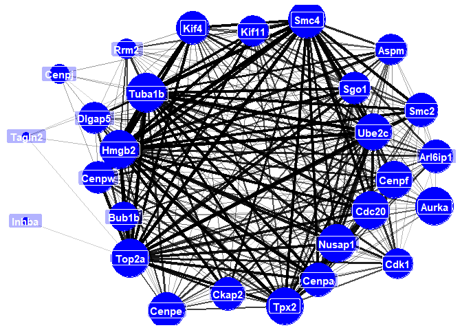

<!-- README.md is generated from README.Rmd. Please edit that file -->

# scWGCNA

<!-- badges: start -->
<!-- badges: end -->

scWGCNA is an adaptation of WGCNA to work with single-cell datasets. The
functionality is presented in
<a href="http://doi.org/10.1002/dvdy.384" target="_blank">Feregrino &
Tschopp 2021</a>

The new version of the package allows for a better workflow.

scWGCNA works with Seurat objects.

## References

<a href="https://bmcbioinformatics.biomedcentral.com/articles/10.1186/1471-2105-9-559" target="_blank">Langfelder,
P., Horvath, S. (2008) WGCNA: an R package for weighted correlation
network analysis. BMC Bioinformatics 9, 559</a>

<a href="https://journals.plos.org/ploscompbiol/article?id=10.1371/journal.pcbi.1001057" target="_blank">Langfelder
P, Luo R, Oldham MC, Horvath S (2011) Is My Network Module Preserved and
Reproducible?. PLOS Computational Biology 7(1): e1001057</a>

<a href="https://doi.org/10.1101/2021.02.09.430383" target="_blank">Feregrino,
C, Tschopp, P (2021) Assessing evolutionary and developmental
transcriptome dynamics in homologous cell types. bioRxiv
2021.02.09.430383</a>

## Installation

To install scWGCNA run in R:

## Basic scWGCNA workflow

### Pseudocell calculation

-   Our first step is to calculate pseudocells from a Seurat object with
    pre.calculated PCA (or other reductions) and cell clusters. For this
    example we are using the small pbmc dataset from Seurat.
    **Warning**: This might be very time or memory consuming depending
    on the size of your dataset. (ca. 15 minutes for 10k cells).
    Consider to run this on a script for a dedicated job.

``` r
library(scWGCNA)
#> 

# A seurat object we use as example
my.small_MmLimbE155
#> An object of class Seurat 
#> 498 features across 281 samples within 2 assays 
#> Active assay: SCT (248 features, 226 variable features)
#>  1 other assay present: RNA
#>  3 dimensional reductions calculated: pca, xtsne, tsne

# Calculate the pseudocells
MmLimbE155.pcells = calculate.pseudocells(s.cells = my.small_MmLimbE155, # Single cells in Seurat object
                                          seeds=0.2, # Fraction of cells to use as seeds to aggregate pseudocells
                                          nn = 10, # Number of neighbors to aggregate
                                          reduction = "pca", # Reduction to use
                                          dims = 1:10) # The dimensions to use
#> Computing nearest neighbor graph
#> Computing SNN
#> Choosing seeds
#> 254 out of 281 Cells will be agreggated into 50 Pseudocells
#> Assining pseudocells
#> Aggregating pseudocell expression
#> Warning: The following arguments are not used: row.names
```

### single-cell WGCNA

-   Our next step is to perform WCGNA analyses From this, we will obtain
    a scWGNCA object, which is a list with information obtained from the
    analyses. For this, we suggest to use the pseudocells, calculated as
    shown above. For the sake of this example, we ask for the analysis
    to be started with all the genes in our example dataset, as this is
    very small. Normally, the function would find variable genes for us.

``` r
# Run scWGCNA
MmLimbE155.scWGCNA = run.scWGCNA(p.cells = MmLimbE155.pcells, # Pseudocells (recommended), or Seurat single cells
                                 s.cells = my.small_MmLimbE155, # single cells in Seurat format
                                 is.pseudocell = T, # We are using single cells twice this time
                                 features = rownames(my.small_MmLimbE155)) # Recommended: variable genes
#> [1] "The following variable genes were not found expressed in the pseudocell object:  ENSMUSG00000030077"
#> [2] "The following variable genes were not found expressed in the pseudocell object:  ENSMUSG00000024256"
#> [1] "We have 246 genes in the variable genes object"
#> Warning: executing %dopar% sequentially: no parallel backend registered
#> Warning in (function (x, y = NULL, robustX = TRUE, robustY = TRUE, use =
#> "all.obs", : bicor: zero MAD in variable 'x'. Pearson correlation was used for
#> individual columns with zero (or missing) MAD.
#> Warning in (function (x, y = NULL, robustX = TRUE, robustY = TRUE, use =
#> "all.obs", : bicor: zero MAD in variable 'y'. Pearson correlation was used for
#> individual columns with zero (or missing) MAD.
#>    Power SFT.R.sq slope truncated.R.sq mean.k. median.k. max.k.
#> 1      1   0.0430  3.71         0.6410 125.000  125.0000  133.0
#> 2      2   0.0879 -3.36         0.7880  66.500   66.0000   77.3
#> 3      3   0.2640 -2.71         0.6600  37.200   36.5000   47.2
#> 4      4   0.1880 -1.50         0.0485  21.900   21.2000   30.0
#> 5      5   0.4690 -1.28         0.4140  13.700   12.9000   22.0
#> 6      6   0.5440 -1.54         0.4510   9.080    8.2700   17.6
#> 7      7   0.5960 -1.56         0.4820   6.410    5.5300   15.0
#> 8      8   0.6390 -1.58         0.5370   4.790    3.8400   13.8
#> 9      9   0.6980 -1.42         0.6150   3.770    2.7400   13.0
#> 10    10   0.6440 -1.37         0.5490   3.100    2.0300   12.5
#> 11    12   0.6900 -1.22         0.6260   2.300    1.1400   11.8
#> 12    14   0.6370 -1.15         0.5920   1.860    0.6810   11.4
#> 13    16   0.1510 -2.01        -0.0884   1.590    0.4290   11.1
#> 14    18   0.6760 -1.14         0.6210   1.400    0.2750   10.9
#> 15    20   0.1280 -1.67        -0.0912   1.260    0.1850   10.7
#> 16    22   0.6840 -1.06         0.6820   1.160    0.1360   10.5
#> 17    24   0.0917 -1.37        -0.0567   1.070    0.0909   10.3
#> 18    26   0.0902 -1.35        -0.0553   1.000    0.0617   10.2
#> 19    28   0.1390 -2.19        -0.0866   0.941    0.0430   10.0
#> 20    30   0.6640 -1.00         0.7240   0.891    0.0305    9.9
#> [1] "The scale-free topology index didn't reach 0.75 with any of the chosen powers, please consider changing the set of genes or cells provided"
#> [1] "Or power is 9"
#> Warning in (function (x, y = NULL, robustX = TRUE, robustY = TRUE, use =
#> "all.obs", : bicor: zero MAD in variable 'x'. Pearson correlation was used for
#> individual columns with zero (or missing) MAD.
#> TOM calculation: adjacency..
#> ..will not use multithreading.
#>  Fraction of slow calculations: 0.000000
#> ..connectivity..
#> ..matrix multiplication (system BLAS)..
#> ..normalization..
#> ..done.
#> [1] "my.height:  0.9871  .... my.Clsize:  15"
#> 16 genes not assigned to any module.
#> 70 genes excluded due to significance.
#> Warning in (function (x, y = NULL, robustX = TRUE, robustY = TRUE, use =
#> "all.obs", : bicor: zero MAD in variable 'x'. Pearson correlation was used for
#> individual columns with zero (or missing) MAD.
#> TOM calculation: adjacency..
#> ..will not use multithreading.
#>  Fraction of slow calculations: 0.000000
#> ..connectivity..
#> ..matrix multiplication (system BLAS)..
#> ..normalization..
#> ..done.
#> [1] "my.height:  0.9866  .... my.Clsize:  15"
#> 12 genes not assigned to any module.
#> 14 genes excluded due to significance.
#> Warning in (function (x, y = NULL, robustX = TRUE, robustY = TRUE, use =
#> "all.obs", : bicor: zero MAD in variable 'x'. Pearson correlation was used for
#> individual columns with zero (or missing) MAD.
```


    #> TOM calculation: adjacency..
    #> ..will not use multithreading.
    #>  Fraction of slow calculations: 0.000000
    #> ..connectivity..
    #> ..matrix multiplication (system BLAS)..
    #> ..normalization..
    #> ..done.
    #> [1] "my.height:  0.9865  .... my.Clsize:  16"
    #> 0 genes not assigned to any module.
    #> 0 genes excluded due to significance.

### Modules of co-expression

-   We can now see which modules where detected by WGCNA after the
    iterations
-   Very important, we can see what is the **average expression** of
    each module per cell, or pseudocell.

``` r
# Plot the gene / modules dendrogram
scWGCNA.plotdendro(scWGCNA.data = MmLimbE155.scWGCNA)
```


``` r
#Look at the membership tables
names(MmLimbE155.scWGCNA$modules)
#> [1] "1_blue"      "2_brown"     "3_green"     "4_red"       "5_turquoise"
#> [6] "6_yellow"

#Let's look at the first module, "blue"
head(MmLimbE155.scWGCNA$modules$`1_blue`)
#>                    Membership        p.val
#> ENSMUSG00000001403  0.8688156 2.911492e-16
#> ENSMUSG00000029177  0.7782598 2.901329e-11
#> ENSMUSG00000020649  0.5091048 1.596436e-04
#> ENSMUSG00000026547  0.3771343 6.938527e-03
#> ENSMUSG00000026605  0.8699181 2.408654e-16
#> ENSMUSG00000030654  0.7681162 7.490872e-11

# We use gene unique identifiers. For this reason we need to translate them to names
my.module = MmLimbE155.scWGCNA$modules$`1_blue`

# We have gene names translation in the misc slot of this seurat object.
my.gnames = my.small_MmLimbE155@misc$gnames
head(my.gnames)
#>                        Gene.stable.ID Gene.name
#> ENSMUSG00000068614 ENSMUSG00000068614     Actc1
#> ENSMUSG00000026459 ENSMUSG00000026459      Myog
#> ENSMUSG00000064179 ENSMUSG00000064179     Tnnt1
#> ENSMUSG00000047281 ENSMUSG00000047281       Sfn
#> ENSMUSG00000018339 ENSMUSG00000018339      Gpx3
#> ENSMUSG00000001506 ENSMUSG00000001506    Col1a1

# Look at the table again
my.module$gname = my.gnames[rownames(my.module), "Gene.name"]
head(my.module)
#>                    Membership        p.val   gname
#> ENSMUSG00000001403  0.8688156 2.911492e-16   Ube2c
#> ENSMUSG00000029177  0.7782598 2.901329e-11   Cenpa
#> ENSMUSG00000020649  0.5091048 1.596436e-04    Rrm2
#> ENSMUSG00000026547  0.3771343 6.938527e-03  Tagln2
#> ENSMUSG00000026605  0.8699181 2.408654e-16   Cenpf
#> ENSMUSG00000030654  0.7681162 7.490872e-11 Arl6ip1

# Here we can see what is the expression of each co-expression module, per cell. This is in one of the list items
head(MmLimbE155.scWGCNA[["sc.MEList"]]$averageExpr)
#>                      AEblue     AEbrown    AEgreen       AEred AEturquoise
#> CTTTGCGGTGCTAGCC -0.5596879 -0.18997600 -0.1111647 -0.28494956  0.29700486
#> CAGCCGAAGTCACGCC -0.5812957  0.15506053 -0.2422277 -0.16606843  0.34152125
#> GCGACCAAGAATCTCC -0.6161389  0.32160113 -0.2422277  0.08564174  0.04568679
#> TGACAACCACCTGGTG -0.4772609 -0.01193024 -0.1263879 -0.08989417  0.59076344
#> TGCGCAGCAGCGTAAG -0.5382255 -0.16473362 -0.0928799 -0.36109354  0.52376012
#> TGACTTTCAGACAAAT -0.4241158 -0.17850570 -0.1346795 -0.15371103  0.49186946
#>                    AEyellow
#> CTTTGCGGTGCTAGCC -0.2587123
#> CAGCCGAAGTCACGCC -0.2587123
#> GCGACCAAGAATCTCC -0.2587123
#> TGACAACCACCTGGTG -0.2024361
#> TGCGCAGCAGCGTAAG -0.1964491
#> TGACTTTCAGACAAAT -0.1952610

# If we want to see the average module expression per pseudocell instead of single cells, we find it here
head(MmLimbE155.scWGCNA[["MEList"]]$averageExpr)
#>                      AEblue     AEbrown    AEgreen       AEred AEturquoise
#> ACGCCAGCATCGGGTC -0.5704408 -0.25087123 -0.1895993 -0.45688811   0.4689498
#> GGCGACTGTAGCTGCC -0.7121218  0.04843604 -0.2167900 -0.33353097   0.4118500
#> ACGGGTCTCGCACTCT -0.5405850 -0.14004902 -0.2371360 -0.13045448   0.7580970
#> CCGTTCACATGTAAGA  0.1071384 -0.15175634 -0.2693426 -0.34220741   0.9344596
#> ACCTTTAGTTCGGCAC  1.1476635 -0.14505818 -0.2175833  0.09946919   0.4129948
#> AGGTCATAGTCGTACT -0.7136724 -0.17375364 -0.3258270 -0.24520398   0.4483282
#>                    AEyellow
#> ACGCCAGCATCGGGTC -0.2271983
#> GGCGACTGTAGCTGCC -0.1778088
#> ACGGGTCTCGCACTCT -0.2289374
#> CCGTTCACATGTAAGA -0.2488376
#> ACCTTTAGTTCGGCAC -0.2126678
#> AGGTCATAGTCGTACT -0.2835482
```

-   We can also plot what’s the mean expression of all, or each module,
    across the single cells

``` r
# Plot the expression of all modules at once
scWGCNA.plotexpression(s.cells = my.small_MmLimbE155, # Single cells in Seurat format
                       scWGCNA.data = MmLimbE155.scWGCNA, # scWGCNA list dataset
                       modules = "all", # Which modules to plot?
                       reduction = "tsne", # Which reduction to plot?
                       ncol=3) # How many columns to use, in case we're plotting several?
```


``` r
#Plot only the expression of the first module, "blue"
scWGCNA.plotexpression(s.cells = my.small_MmLimbE155,
                       scWGCNA.data = MmLimbE155.scWGCNA,
                       modules = 1)
```


-   We can also plot the different modules in a network visualization,
    to observe the relationships between the genes.

``` r
# First generate the networks in the scWCGNA object
MmLimbE155.scWGCNA = scWGCNA.networks(scWGCNA.data = MmLimbE155.scWGCNA)
#> Registered S3 method overwritten by 'GGally':
#>   method from   
#>   +.gg   ggplot2

# Plot the module "blue" as a network
scWGCNA.plotnetwork(MmLimbE155.scWGCNA, module=1)
```


``` r
# Plot the module "blue" as a network. Again, we are using gene unique identifiers, not very informative.
# For this, we use the gene names translation we had before.
scWGCNA.plotnetwork(MmLimbE155.scWGCNA, module=1, gnames = my.gnames)
```



-   Perform comparative WCGNA analyses and output an integrated HTML
    report

<!-- -->

    scWGNA.compare.report(data, test, test.names, project.name, ortho, ortho.sp)

## Output examples

These are the HTML outputs you can expect from the functions. The data
used in our publication produced [this HTML report
output](https://htmlpreview.github.io/?https://github.com/CFeregrino/scWGCNA/blob/main/HTMLexamples/WGCNA_report_E15test3_080421.html)
from the scWGNA.report function, and [this HTML report
output](https://htmlpreview.github.io/?https://github.com/CFeregrino/scWGCNA/blob/main/HTMLexamples/WGNA_comparative_E15.nb.html)
from the scWGNA.compare.report function.
