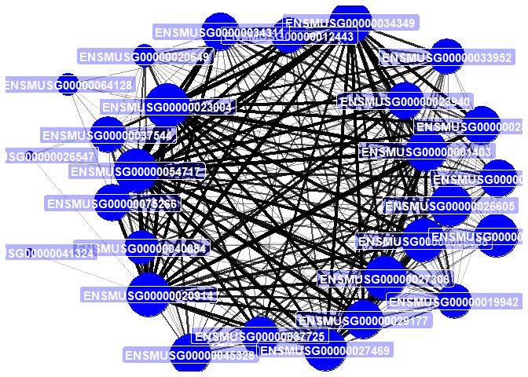
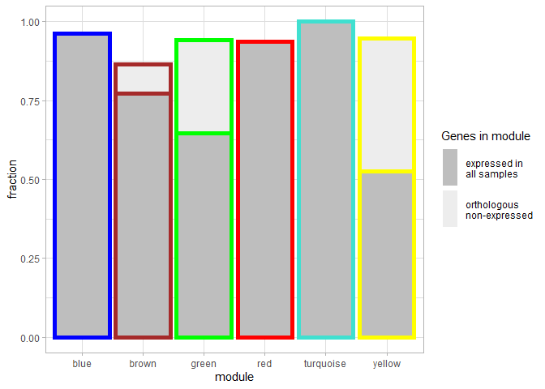
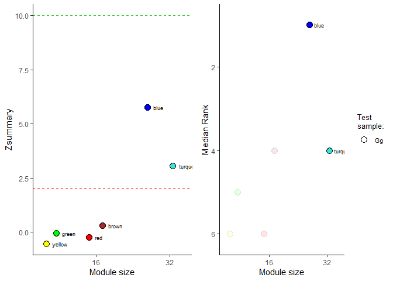
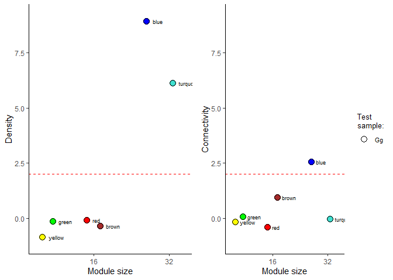

<!-- README.md is generated from README.Rmd. Please edit that file -->

# scWGCNA

<!-- badges: start -->
<!-- badges: end -->

scWGCNA is an adaptation of WGCNA to work with single-cell datasets. The
functionality is presented in
<a href="http://doi.org/10.1002/dvdy.384" target="_blank">Feregrino &
Tschopp 2021</a>

The new version of the package allows for a better workflow, and more
interaction with the data.

scWGCNA works with Seurat objects.

## References

<a href="https://bmcbioinformatics.biomedcentral.com/articles/10.1186/1471-2105-9-559" target="_blank">Langfelder,
P., Horvath, S. (2008) WGCNA: an R package for weighted correlation
network analysis. BMC Bioinformatics 9, 559</a>

<a href="https://journals.plos.org/ploscompbiol/article?id=10.1371/journal.pcbi.1001057" target="_blank">Langfelder
P, Luo R, Oldham MC, Horvath S (2011) Is My Network Module Preserved and
Reproducible?. PLOS Computational Biology 7(1): e1001057</a>

<a href="https://doi.org/10.1101/2021.02.09.430383" target="_blank">Feregrino,
C, Tschopp, P (2021) Assessing evolutionary and developmental
transcriptome dynamics in homologous cell types. bioRxiv
2021.02.09.430383</a>

## Installation

To install scWGCNA run in R:

## Basic scWGCNA workflow

### Pseudocell calculation

-   Our first step is to calculate pseudocells from a Seurat object with
    pre-calculated PCA (or other reductions) and cell clusters. For this
    example we are using the small pbmc dataset from Seurat.
    **Warning**: This might be very time or memory consuming depending
    on the size of your dataset. (ca. 15 minutes for 10k cells).
    Consider to run this on a script for a dedicated job.

``` r
library(scWGCNA)
#> 

# A seurat object we use as example
my.small_MmLimbE155
#> An object of class Seurat 
#> 498 features across 281 samples within 2 assays 
#> Active assay: SCT (248 features, 226 variable features)
#>  1 other assay present: RNA
#>  3 dimensional reductions calculated: pca, xtsne, tsne

# Calculate the pseudocells
MmLimbE155.pcells = calculate.pseudocells(s.cells = my.small_MmLimbE155, # Single cells in Seurat object
                                          seeds=0.2, # Fraction of cells to use as seeds to aggregate pseudocells
                                          nn = 10, # Number of neighbors to aggregate
                                          reduction = "pca", # Reduction to use
                                          dims = 1:10) # The dimensions to use
#> Computing nearest neighbor graph
#> Computing SNN
#> Choosing seeds
#> 254 out of 281 Cells will be agreggated into 50 Pseudocells
#> Assining pseudocells
#> Aggregating pseudocell expression
#> Warning: The following arguments are not used: row.names
```

### single-cell WGCNA

-   Our next step is to perform WCGNA analyses From this, we will obtain
    a scWGNCA object, which is a list with information obtained from the
    analyses. For this, we suggest to use the pseudocells, calculated as
    shown above. For the sake of this example, we ask for the analysis
    to be started with all the genes in our example dataset, as this is
    very small. Normally, the function would find variable genes for us.

``` r
# Run scWGCNA
MmLimbE155.scWGCNA = run.scWGCNA(p.cells = MmLimbE155.pcells, # Pseudocells (recommended), or Seurat single cells
                                 s.cells = my.small_MmLimbE155, # single cells in Seurat format
                                 is.pseudocell = T, # We are using single cells twice this time
                                 features = rownames(my.small_MmLimbE155)) # Recommended: variable genes
#> [1] "The following variable genes were not found expressed in the pseudocell object:  ENSMUSG00000030077"
#> [2] "The following variable genes were not found expressed in the pseudocell object:  ENSMUSG00000024256"
#> [1] "We have 246 genes in the variable genes object"
#> Warning: executing %dopar% sequentially: no parallel backend registered
#> Warning in (function (x, y = NULL, robustX = TRUE, robustY = TRUE, use =
#> "all.obs", : bicor: zero MAD in variable 'x'. Pearson correlation was used for
#> individual columns with zero (or missing) MAD.
#> Warning in (function (x, y = NULL, robustX = TRUE, robustY = TRUE, use =
#> "all.obs", : bicor: zero MAD in variable 'y'. Pearson correlation was used for
#> individual columns with zero (or missing) MAD.
#>    Power SFT.R.sq slope truncated.R.sq mean.k. median.k. max.k.
#> 1      1   0.0430  3.71         0.6410 125.000  125.0000  133.0
#> 2      2   0.0879 -3.36         0.7880  66.500   66.0000   77.3
#> 3      3   0.2640 -2.71         0.6600  37.200   36.5000   47.2
#> 4      4   0.1880 -1.50         0.0485  21.900   21.2000   30.0
#> 5      5   0.4690 -1.28         0.4140  13.700   12.9000   22.0
#> 6      6   0.5440 -1.54         0.4510   9.080    8.2700   17.6
#> 7      7   0.5960 -1.56         0.4820   6.410    5.5300   15.0
#> 8      8   0.6390 -1.58         0.5370   4.790    3.8400   13.8
#> 9      9   0.6980 -1.42         0.6150   3.770    2.7400   13.0
#> 10    10   0.6440 -1.37         0.5490   3.100    2.0300   12.5
#> 11    12   0.6900 -1.22         0.6260   2.300    1.1400   11.8
#> 12    14   0.6370 -1.15         0.5920   1.860    0.6810   11.4
#> 13    16   0.1510 -2.01        -0.0884   1.590    0.4290   11.1
#> 14    18   0.6760 -1.14         0.6210   1.400    0.2750   10.9
#> 15    20   0.1280 -1.67        -0.0912   1.260    0.1850   10.7
#> 16    22   0.6840 -1.06         0.6820   1.160    0.1360   10.5
#> 17    24   0.0917 -1.37        -0.0567   1.070    0.0909   10.3
#> 18    26   0.0902 -1.35        -0.0553   1.000    0.0617   10.2
#> 19    28   0.1390 -2.19        -0.0866   0.941    0.0430   10.0
#> 20    30   0.6640 -1.00         0.7240   0.891    0.0305    9.9
#> [1] "The scale-free topology index didn't reach 0.75 with any of the chosen powers, please consider changing the set of genes or cells provided"
#> [1] "Or power is 9"
#> Warning in (function (x, y = NULL, robustX = TRUE, robustY = TRUE, use =
#> "all.obs", : bicor: zero MAD in variable 'x'. Pearson correlation was used for
#> individual columns with zero (or missing) MAD.
#> TOM calculation: adjacency..
#> ..will not use multithreading.
#>  Fraction of slow calculations: 0.000000
#> ..connectivity..
#> ..matrix multiplication (system BLAS)..
#> ..normalization..
#> ..done.
#> [1] "my.height:  0.9871  .... my.Clsize:  15"
#> 16 genes not assigned to any module.
#> 70 genes excluded due to significance.
#> Warning in (function (x, y = NULL, robustX = TRUE, robustY = TRUE, use =
#> "all.obs", : bicor: zero MAD in variable 'x'. Pearson correlation was used for
#> individual columns with zero (or missing) MAD.
#> TOM calculation: adjacency..
#> ..will not use multithreading.
#>  Fraction of slow calculations: 0.000000
#> ..connectivity..
#> ..matrix multiplication (system BLAS)..
#> ..normalization..
#> ..done.
#> [1] "my.height:  0.9866  .... my.Clsize:  15"
#> 12 genes not assigned to any module.
#> 14 genes excluded due to significance.
#> Warning in (function (x, y = NULL, robustX = TRUE, robustY = TRUE, use =
#> "all.obs", : bicor: zero MAD in variable 'x'. Pearson correlation was used for
#> individual columns with zero (or missing) MAD.
```


    #> TOM calculation: adjacency..
    #> ..will not use multithreading.
    #>  Fraction of slow calculations: 0.000000
    #> ..connectivity..
    #> ..matrix multiplication (system BLAS)..
    #> ..normalization..
    #> ..done.
    #> [1] "my.height:  0.9865  .... my.Clsize:  16"
    #> 0 genes not assigned to any module.
    #> 0 genes excluded due to significance.

### Modules of co-expression

-   We can now see which modules where detected by WGCNA after the
    iterations
-   Very important, we can see what is the **average expression** of
    each module per cell, or pseudocell.

``` r
# Plot the gene / modules dendrogram
scW.p.dendro(scWGCNA.data = MmLimbE155.scWGCNA)
```


``` r
#Look at the membership tables
names(MmLimbE155.scWGCNA$modules)
#> [1] "1_blue"      "2_brown"     "3_green"     "4_red"       "5_turquoise"
#> [6] "6_yellow"

#Let's look at the first module, "blue"
head(MmLimbE155.scWGCNA$modules$`1_blue`)
#>                    Membership        p.val
#> ENSMUSG00000001403  0.8688156 2.911492e-16
#> ENSMUSG00000029177  0.7782598 2.901329e-11
#> ENSMUSG00000020649  0.5091048 1.596436e-04
#> ENSMUSG00000026547  0.3771343 6.938527e-03
#> ENSMUSG00000026605  0.8699181 2.408654e-16
#> ENSMUSG00000030654  0.7681162 7.490872e-11

# We use gene unique identifiers. For this reason we need to translate them to names
my.module = MmLimbE155.scWGCNA$modules$`1_blue`

# We have gene names translation in the misc slot of this seurat object.
my.gnames = my.small_MmLimbE155@misc$gnames
head(my.gnames)
#>                        Gene.stable.ID Gene.name
#> ENSMUSG00000068614 ENSMUSG00000068614     Actc1
#> ENSMUSG00000026459 ENSMUSG00000026459      Myog
#> ENSMUSG00000064179 ENSMUSG00000064179     Tnnt1
#> ENSMUSG00000047281 ENSMUSG00000047281       Sfn
#> ENSMUSG00000018339 ENSMUSG00000018339      Gpx3
#> ENSMUSG00000001506 ENSMUSG00000001506    Col1a1

# Look at the table again
my.module$gname = my.gnames[rownames(my.module), "Gene.name"]
head(my.module)
#>                    Membership        p.val   gname
#> ENSMUSG00000001403  0.8688156 2.911492e-16   Ube2c
#> ENSMUSG00000029177  0.7782598 2.901329e-11   Cenpa
#> ENSMUSG00000020649  0.5091048 1.596436e-04    Rrm2
#> ENSMUSG00000026547  0.3771343 6.938527e-03  Tagln2
#> ENSMUSG00000026605  0.8699181 2.408654e-16   Cenpf
#> ENSMUSG00000030654  0.7681162 7.490872e-11 Arl6ip1

# Here we can see what is the expression of each co-expression module, per cell. This is in one of the list items
head(MmLimbE155.scWGCNA[["sc.MEList"]]$averageExpr)
#>                      AEblue     AEbrown    AEgreen       AEred AEturquoise
#> CTTTGCGGTGCTAGCC -0.5596879 -0.18997600 -0.1111647 -0.28494956  0.29700486
#> CAGCCGAAGTCACGCC -0.5812957  0.15506053 -0.2422277 -0.16606843  0.34152125
#> GCGACCAAGAATCTCC -0.6161389  0.32160113 -0.2422277  0.08564174  0.04568679
#> TGACAACCACCTGGTG -0.4772609 -0.01193024 -0.1263879 -0.08989417  0.59076344
#> TGCGCAGCAGCGTAAG -0.5382255 -0.16473362 -0.0928799 -0.36109354  0.52376012
#> TGACTTTCAGACAAAT -0.4241158 -0.17850570 -0.1346795 -0.15371103  0.49186946
#>                    AEyellow
#> CTTTGCGGTGCTAGCC -0.2587123
#> CAGCCGAAGTCACGCC -0.2587123
#> GCGACCAAGAATCTCC -0.2587123
#> TGACAACCACCTGGTG -0.2024361
#> TGCGCAGCAGCGTAAG -0.1964491
#> TGACTTTCAGACAAAT -0.1952610

# If we want to see the average module expression per pseudocell instead of single cells, we find it here
head(MmLimbE155.scWGCNA[["MEList"]]$averageExpr)
#>                      AEblue     AEbrown    AEgreen       AEred AEturquoise
#> ACGCCAGCATCGGGTC -0.5704408 -0.25087123 -0.1895993 -0.45688811   0.4689498
#> GGCGACTGTAGCTGCC -0.7121218  0.04843604 -0.2167900 -0.33353097   0.4118500
#> ACGGGTCTCGCACTCT -0.5405850 -0.14004902 -0.2371360 -0.13045448   0.7580970
#> CCGTTCACATGTAAGA  0.1071384 -0.15175634 -0.2693426 -0.34220741   0.9344596
#> ACCTTTAGTTCGGCAC  1.1476635 -0.14505818 -0.2175833  0.09946919   0.4129948
#> AGGTCATAGTCGTACT -0.7136724 -0.17375364 -0.3258270 -0.24520398   0.4483282
#>                    AEyellow
#> ACGCCAGCATCGGGTC -0.2271983
#> GGCGACTGTAGCTGCC -0.1778088
#> ACGGGTCTCGCACTCT -0.2289374
#> CCGTTCACATGTAAGA -0.2488376
#> ACCTTTAGTTCGGCAC -0.2126678
#> AGGTCATAGTCGTACT -0.2835482
```

-   Using the information of the modules we calculated, we can also
    calculate what’s the average expression of each module in any set of
    cells. This, as long as we have a seurat object with the same gene
    names as the ones used to calculate the modules. This is very useful
    to calculate expression and module activityin any other dataset, as
    if it was any gene.
-   Moreover, we can calculate the membership of each gene to its
    module, taking as a reference the expression of any other expression
    dataset. These memberships, can be then compared across samples.

``` r
# Here we can calculate the different eigengenes, using the single cell data from the mouse.
MmLimb.eigengenes.sc = scW.eigen(modules = MmLimbE155.scWGCNA, seurat = my.small_MmLimbE155)

# We can then find the expression of the different modules in this slot
head(MmLimb.eigengenes.sc$Module.Eigengenes$averageExpr)
#>                      AEblue     AEbrown     AEgreen       AEred AEturquoise
#> CTTTGCGGTGCTAGCC -0.5666050 -0.20630177 -0.12556986 -0.30354656 0.220587445
#> CAGCCGAAGTCACGCC -0.5668321  0.10371440 -0.25138105 -0.16558827 0.273107282
#> GCGACCAAGAATCTCC -0.5973933  0.20560227 -0.25138105  0.07360435 0.001758538
#> TGACAACCACCTGGTG -0.4834014 -0.03744077 -0.14168952 -0.10494178 0.526712095
#> TGCGCAGCAGCGTAAG -0.5456373 -0.13535372 -0.05391711 -0.35849142 0.566142348
#> TGACTTTCAGACAAAT -0.4305833 -0.12896541 -0.09961819 -0.13392250 0.533846124
#>                    AEyellow
#> CTTTGCGGTGCTAGCC -0.2593248
#> CAGCCGAAGTCACGCC -0.2593248
#> GCGACCAAGAATCTCC -0.2593248
#> TGACAACCACCTGGTG -0.2095787
#> TGCGCAGCAGCGTAAG -0.2095787
#> TGACTTTCAGACAAAT -0.1710189

# we can explore the membership of each gene to its module, by examining the scWGCNA data list object
head(MmLimbE155.scWGCNA[["modules"]]$`1_blue`)
#>                    Membership        p.val
#> ENSMUSG00000001403  0.8688156 2.911492e-16
#> ENSMUSG00000029177  0.7782598 2.901329e-11
#> ENSMUSG00000020649  0.5091048 1.596436e-04
#> ENSMUSG00000026547  0.3771343 6.938527e-03
#> ENSMUSG00000026605  0.8699181 2.408654e-16
#> ENSMUSG00000030654  0.7681162 7.490872e-11

# And we can access the membership and pvalues calculated from another data set, by looking at these tables
head(MmLimb.eigengenes.sc$Gene.Module.Membership)
#>                         kMEblue    kMEbrown      kMEgreen       kMEred
#> ENSMUSG00000068614  0.004988158 -0.04243095  0.0001841659 -0.075004805
#> ENSMUSG00000026459  0.023773792 -0.05955297 -0.0009830381 -0.056949537
#> ENSMUSG00000064179  0.034404667 -0.07224691 -0.0116670263 -0.032814308
#> ENSMUSG00000047281  0.040337292 -0.03565635  0.9270536633 -0.154764603
#> ENSMUSG00000018339 -0.077220611  0.89845543 -0.0075343859  0.002345408
#> ENSMUSG00000001506  0.055833156 -0.03407945 -0.1787681447  0.574112631
#>                    kMEturquoise    kMEyellow
#> ENSMUSG00000068614   -0.2716580  0.943436524
#> ENSMUSG00000026459   -0.2583756  0.959116813
#> ENSMUSG00000064179   -0.2976944  0.906089885
#> ENSMUSG00000047281   -0.3096576 -0.057360936
#> ENSMUSG00000018339   -0.1570514 -0.005080984
#> ENSMUSG00000001506   -0.3107846 -0.121632199

head(MmLimb.eigengenes.sc$Module.Membership.Pvalue)
#>                      kMEblue      kMEbrown      kMEgreen       kMEred
#> ENSMUSG00000068614 0.9336571  4.786839e-01  9.975478e-01 2.100342e-01
#> ENSMUSG00000026459 0.6915142  3.198711e-01  9.869111e-01 3.415206e-01
#> ENSMUSG00000064179 0.5657468  2.273325e-01  8.456201e-01 5.838542e-01
#> ENSMUSG00000047281 0.5006698  5.516868e-01 6.967296e-121 9.364909e-03
#> ENSMUSG00000018339 0.1968385 9.780259e-102  8.999392e-01 9.687780e-01
#> ENSMUSG00000001506 0.3510834  5.694277e-01  2.633136e-03 4.895266e-26
#>                    kMEturquoise     kMEyellow
#> ENSMUSG00000068614 3.824370e-06 8.673511e-136
#> ENSMUSG00000026459 1.151530e-05 5.618899e-155
#> ENSMUSG00000064179 3.700557e-07 3.123332e-106
#> ENSMUSG00000047281 1.167770e-07  3.380388e-01
#> ENSMUSG00000018339 8.356595e-03  9.324254e-01
#> ENSMUSG00000001506 1.044741e-07  4.160905e-02
```

-   We can also plot what’s the mean expression of all, or each module,
    across the single cells

``` r
# Plot the expression of all modules at once
scW.p.expression(s.cells = my.small_MmLimbE155, # Single cells in Seurat format
                       scWGCNA.data = MmLimbE155.scWGCNA, # scWGCNA list dataset
                       modules = "all", # Which modules to plot?
                       reduction = "tsne", # Which reduction to plot?
                       ncol=3) # How many columns to use, in case we're plotting several?
```


``` r
#Plot only the expression of the first module, "blue"
scW.p.expression(s.cells = my.small_MmLimbE155,
                       scWGCNA.data = MmLimbE155.scWGCNA,
                       modules = 1)
```


-   We can also plot the different modules in a network visualization,
    to observe the relationships between the genes.

``` r
# First generate the networks in the scWCGNA object
MmLimbE155.scWGCNA = scWGCNA.networks(scWGCNA.data = MmLimbE155.scWGCNA)
#> Registered S3 method overwritten by 'GGally':
#>   method from   
#>   +.gg   ggplot2

# Plot the module "blue" as a network
scW.p.network(MmLimbE155.scWGCNA, module=1)
```



``` r
# Plot the module "blue" as a network. Again, we are using gene unique identifiers, not very informative.
# For this, we use the gene names translation we had before.
scW.p.network(MmLimbE155.scWGCNA, module=1, gnames = my.gnames)
```


### Module comparison accross samples

-   We can now run a comparative analysis against other samples
    (different species, treatments, etc.).  
    This is basically running the modulePreservation function from
    WGCNA, using the data we have generated so far. For this, we use
    data from another species as the test, which will be compared
    against the reference (our calculated scWGCNA data). For this, in
    case we have different species, we need a table of 1-to-1
    orthologues.

``` r
# A Seurat object with chicken limb cells
my.small_GgLimbHH29
#> An object of class Seurat 
#> 489 features across 288 samples within 2 assays 
#> Active assay: SCT (239 features, 196 variable features)
#>  1 other assay present: RNA
#>  3 dimensional reductions calculated: pca, xtsne, tsne

# We calculate pseudocells for this object
Gg.ps=calculate.pseudocells(my.small_GgLimbHH29, dims = 1:10)
#> Computing nearest neighbor graph
#> Computing SNN
#> Choosing seeds
#> 254 out of 288 Cells will be agreggated into 50 Pseudocells
#> Assining pseudocells
#> Aggregating pseudocell expression
#> Warning: The following arguments are not used: row.names

# Our Seurat objects contain gene names equivalencies in the misc slot.
# We use them to biuld a table of orthologous genes
my.ortho = merge(my.small_MmLimbE155@misc$gnames,my.small_GgLimbHH29@misc$gnames, by = "Gene.name")
head(my.ortho)
#>   Gene.name   Gene.stable.ID.x   Gene.stable.ID.y
#> 1         a ENSMUSG00000027596 ENSGALG00000039101
#> 2      Acan ENSMUSG00000030607 ENSGALG00000006725
#> 3     Acta2 ENSMUSG00000035783 ENSGALG00000006343
#> 4     Actc1 ENSMUSG00000068614 ENSGALG00000009844
#> 5   Adamts1 ENSMUSG00000022893 ENSGALG00000040342
#> 6   Adcyap1 ENSMUSG00000024256 ENSGALG00000014858
my.ortho=my.ortho[,2:3]

# We then run the comparative analysis
MmvGg.comparative = scWGNA.compare(scWGCNA.data = MmLimbE155.scWGCNA,
                                   test.list = list(Gg.ps),
                                   test.names = c("Gg"),
                                   ortho = my.ortho, # not needed unless reference and tests have different gene names
                                   ortho.sp = c(2))
#>   ..Excluding 15 genes from the calculation due to too many missing samples or zero variance.
#> Warning in bicor(datExpr, datME, , use = "p"): bicor: zero MAD in variable 'x'.
#> Pearson correlation was used for individual columns with zero (or missing) MAD.
#> Warning in bicor(datExpr, datME, , use = "p"): bicor: zero MAD in variable 'x'.
#> Pearson correlation was used for individual columns with zero (or missing) MAD.
#> Warning in bicor(datRef[, modGenes[[j]]], use = "p", quick =
#> as.numeric(opt$quickCor)): bicor: zero MAD in variable 'x'. Pearson correlation
#> was used for individual columns with zero (or missing) MAD.
#> Warning in bicor(datTest[, modGenes[[j]]], use = "p", quick =
#> as.numeric(opt$quickCor)): bicor: zero MAD in variable 'x'. Pearson correlation
#> was used for individual columns with zero (or missing) MAD.
#> Warning in bicor(datRef[, modGenes[[j]]], use = "p", quick =
#> as.numeric(opt$quickCor)): bicor: zero MAD in variable 'x'. Pearson correlation
#> was used for individual columns with zero (or missing) MAD.
#> Warning in bicor(datTest[, modGenes[[j]]], use = "p", quick =
#> as.numeric(opt$quickCor)): bicor: zero MAD in variable 'x'. Pearson correlation
#> was used for individual columns with zero (or missing) MAD.
#> Warning in bicor(datRef[, modGenes[[j]]], use = "p", quick =
#> as.numeric(opt$quickCor)): bicor: zero MAD in variable 'x'. Pearson correlation
#> was used for individual columns with zero (or missing) MAD.
#> Warning in bicor(datTest[, modGenes[[j]]], use = "p", quick =
#> as.numeric(opt$quickCor)): bicor: zero MAD in variable 'x'. Pearson correlation
#> was used for individual columns with zero (or missing) MAD.
#> Warning in bicor(datRef[, modGenes[[j]]], use = "p", quick =
#> as.numeric(opt$quickCor)): bicor: zero MAD in variable 'x'. Pearson correlation
#> was used for individual columns with zero (or missing) MAD.
#> Warning in bicor(datTest[, modGenes[[j]]], use = "p", quick =
#> as.numeric(opt$quickCor)): bicor: zero MAD in variable 'x'. Pearson correlation
#> was used for individual columns with zero (or missing) MAD.
#> Warning in bicor(datRef[, modGenes[[j]]], use = "p", quick =
#> as.numeric(opt$quickCor)): bicor: zero MAD in variable 'x'. Pearson correlation
#> was used for individual columns with zero (or missing) MAD.
#> Warning in bicor(datTest[, modGenes[[j]]], use = "p", quick =
#> as.numeric(opt$quickCor)): bicor: zero MAD in variable 'x'. Pearson correlation
#> was used for individual columns with zero (or missing) MAD.

#> Warning in bicor(datTest[, modGenes[[j]]], use = "p", quick =
#> as.numeric(opt$quickCor)): bicor: zero MAD in variable 'x'. Pearson correlation
#> was used for individual columns with zero (or missing) MAD.
#> Warning in bicor(datRef[, modGenes[[j]]], use = "p", quick =
#> as.numeric(opt$quickCor)): bicor: zero MAD in variable 'x'. Pearson correlation
#> was used for individual columns with zero (or missing) MAD.
#> Warning in bicor(datTest[, modGenes[[j]]], use = "p", quick =
#> as.numeric(opt$quickCor)): bicor: zero MAD in variable 'x'. Pearson correlation
#> was used for individual columns with zero (or missing) MAD.
#> Warning in bicor(datExpr, datME, , use = "p"): bicor: zero MAD in variable 'x'.
#> Pearson correlation was used for individual columns with zero (or missing) MAD.

#> Warning in bicor(datExpr, datME, , use = "p"): bicor: zero MAD in variable 'x'.
#> Pearson correlation was used for individual columns with zero (or missing) MAD.

#> Warning in bicor(datExpr, datME, , use = "p"): bicor: zero MAD in variable 'x'.
#> Pearson correlation was used for individual columns with zero (or missing) MAD.
#> Warning in bicor(datRef[, modGenes[[j]]], use = "p", quick =
#> as.numeric(opt$quickCor)): bicor: zero MAD in variable 'x'. Pearson correlation
#> was used for individual columns with zero (or missing) MAD.
#> Warning in bicor(datRefP[, modGenes[[j]]], use = "p", quick =
#> as.numeric(opt$quickCor)): bicor: zero MAD in variable 'x'. Pearson correlation
#> was used for individual columns with zero (or missing) MAD.
#> Warning in bicor(datTest[, modGenes[[j]]], use = "p", quick =
#> as.numeric(opt$quickCor)): bicor: zero MAD in variable 'x'. Pearson correlation
#> was used for individual columns with zero (or missing) MAD.
#> Warning in bicor(datRef[, modGenes[[j]]], use = "p", quick =
#> as.numeric(opt$quickCor)): bicor: zero MAD in variable 'x'. Pearson correlation
#> was used for individual columns with zero (or missing) MAD.
#> Warning in bicor(datRefP[, modGenes[[j]]], use = "p", quick =
#> as.numeric(opt$quickCor)): bicor: zero MAD in variable 'x'. Pearson correlation
#> was used for individual columns with zero (or missing) MAD.
#> Warning in bicor(datTest[, modGenes[[j]]], use = "p", quick =
#> as.numeric(opt$quickCor)): bicor: zero MAD in variable 'x'. Pearson correlation
#> was used for individual columns with zero (or missing) MAD.
#> Warning in bicor(datRef[, modGenes[[j]]], use = "p", quick =
#> as.numeric(opt$quickCor)): bicor: zero MAD in variable 'x'. Pearson correlation
#> was used for individual columns with zero (or missing) MAD.
#> Warning in bicor(datRefP[, modGenes[[j]]], use = "p", quick =
#> as.numeric(opt$quickCor)): bicor: zero MAD in variable 'x'. Pearson correlation
#> was used for individual columns with zero (or missing) MAD.
#> Warning in bicor(datTest[, modGenes[[j]]], use = "p", quick =
#> as.numeric(opt$quickCor)): bicor: zero MAD in variable 'x'. Pearson correlation
#> was used for individual columns with zero (or missing) MAD.
#> Warning in bicor(datRef[, modGenes[[j]]], use = "p", quick =
#> as.numeric(opt$quickCor)): bicor: zero MAD in variable 'x'. Pearson correlation
#> was used for individual columns with zero (or missing) MAD.
#> Warning in bicor(datRefP[, modGenes[[j]]], use = "p", quick =
#> as.numeric(opt$quickCor)): bicor: zero MAD in variable 'x'. Pearson correlation
#> was used for individual columns with zero (or missing) MAD.
#> Warning in bicor(datTest[, modGenes[[j]]], use = "p", quick =
#> as.numeric(opt$quickCor)): bicor: zero MAD in variable 'x'. Pearson correlation
#> was used for individual columns with zero (or missing) MAD.
#> Warning in bicor(datRef[, modGenes[[j]]], use = "p", quick =
#> as.numeric(opt$quickCor)): bicor: zero MAD in variable 'x'. Pearson correlation
#> was used for individual columns with zero (or missing) MAD.
#> Warning in bicor(datRefP[, modGenes[[j]]], use = "p", quick =
#> as.numeric(opt$quickCor)): bicor: zero MAD in variable 'x'. Pearson correlation
#> was used for individual columns with zero (or missing) MAD.
#> Warning in bicor(datTest[, modGenes[[j]]], use = "p", quick =
#> as.numeric(opt$quickCor)): bicor: zero MAD in variable 'x'. Pearson correlation
#> was used for individual columns with zero (or missing) MAD.
#> Warning in bicor(datRefP[, modGenes[[j]]], use = "p", quick =
#> as.numeric(opt$quickCor)): bicor: zero MAD in variable 'x'. Pearson correlation
#> was used for individual columns with zero (or missing) MAD.
#> Warning in bicor(datTest[, modGenes[[j]]], use = "p", quick =
#> as.numeric(opt$quickCor)): bicor: zero MAD in variable 'x'. Pearson correlation
#> was used for individual columns with zero (or missing) MAD.
#> Warning in bicor(datRef[, modGenes[[j]]], use = "p", quick =
#> as.numeric(opt$quickCor)): bicor: zero MAD in variable 'x'. Pearson correlation
#> was used for individual columns with zero (or missing) MAD.
#> Warning in bicor(datRefP[, modGenes[[j]]], use = "p", quick =
#> as.numeric(opt$quickCor)): bicor: zero MAD in variable 'x'. Pearson correlation
#> was used for individual columns with zero (or missing) MAD.
#> Warning in bicor(datTest[, modGenes[[j]]], use = "p", quick =
#> as.numeric(opt$quickCor)): bicor: zero MAD in variable 'x'. Pearson correlation
#> was used for individual columns with zero (or missing) MAD.
#> Warning in bicor(datExpr, datME, , use = "p"): bicor: zero MAD in variable 'x'.
#> Pearson correlation was used for individual columns with zero (or missing) MAD.

#> Warning in bicor(datExpr, datME, , use = "p"): bicor: zero MAD in variable 'x'.
#> Pearson correlation was used for individual columns with zero (or missing) MAD.

#> Warning in bicor(datExpr, datME, , use = "p"): bicor: zero MAD in variable 'x'.
#> Pearson correlation was used for individual columns with zero (or missing) MAD.
#> Warning in bicor(datRef[, modGenes[[j]]], use = "p", quick =
#> as.numeric(opt$quickCor)): bicor: zero MAD in variable 'x'. Pearson correlation
#> was used for individual columns with zero (or missing) MAD.
#> Warning in bicor(datRefP[, modGenes[[j]]], use = "p", quick =
#> as.numeric(opt$quickCor)): bicor: zero MAD in variable 'x'. Pearson correlation
#> was used for individual columns with zero (or missing) MAD.
#> Warning in bicor(datTest[, modGenes[[j]]], use = "p", quick =
#> as.numeric(opt$quickCor)): bicor: zero MAD in variable 'x'. Pearson correlation
#> was used for individual columns with zero (or missing) MAD.
#> Warning in bicor(datRef[, modGenes[[j]]], use = "p", quick =
#> as.numeric(opt$quickCor)): bicor: zero MAD in variable 'x'. Pearson correlation
#> was used for individual columns with zero (or missing) MAD.
#> Warning in bicor(datRefP[, modGenes[[j]]], use = "p", quick =
#> as.numeric(opt$quickCor)): bicor: zero MAD in variable 'x'. Pearson correlation
#> was used for individual columns with zero (or missing) MAD.
#> Warning in bicor(datTest[, modGenes[[j]]], use = "p", quick =
#> as.numeric(opt$quickCor)): bicor: zero MAD in variable 'x'. Pearson correlation
#> was used for individual columns with zero (or missing) MAD.
#> Warning in bicor(datRef[, modGenes[[j]]], use = "p", quick =
#> as.numeric(opt$quickCor)): bicor: zero MAD in variable 'x'. Pearson correlation
#> was used for individual columns with zero (or missing) MAD.
#> Warning in bicor(datRefP[, modGenes[[j]]], use = "p", quick =
#> as.numeric(opt$quickCor)): bicor: zero MAD in variable 'x'. Pearson correlation
#> was used for individual columns with zero (or missing) MAD.
#> Warning in bicor(datTest[, modGenes[[j]]], use = "p", quick =
#> as.numeric(opt$quickCor)): bicor: zero MAD in variable 'x'. Pearson correlation
#> was used for individual columns with zero (or missing) MAD.
#> Warning in bicor(datRef[, modGenes[[j]]], use = "p", quick =
#> as.numeric(opt$quickCor)): bicor: zero MAD in variable 'x'. Pearson correlation
#> was used for individual columns with zero (or missing) MAD.
#> Warning in bicor(datRefP[, modGenes[[j]]], use = "p", quick =
#> as.numeric(opt$quickCor)): bicor: zero MAD in variable 'x'. Pearson correlation
#> was used for individual columns with zero (or missing) MAD.
#> Warning in bicor(datTest[, modGenes[[j]]], use = "p", quick =
#> as.numeric(opt$quickCor)): bicor: zero MAD in variable 'x'. Pearson correlation
#> was used for individual columns with zero (or missing) MAD.
#> Warning in bicor(datRef[, modGenes[[j]]], use = "p", quick =
#> as.numeric(opt$quickCor)): bicor: zero MAD in variable 'x'. Pearson correlation
#> was used for individual columns with zero (or missing) MAD.
#> Warning in bicor(datRefP[, modGenes[[j]]], use = "p", quick =
#> as.numeric(opt$quickCor)): bicor: zero MAD in variable 'x'. Pearson correlation
#> was used for individual columns with zero (or missing) MAD.
#> Warning in bicor(datTest[, modGenes[[j]]], use = "p", quick =
#> as.numeric(opt$quickCor)): bicor: zero MAD in variable 'x'. Pearson correlation
#> was used for individual columns with zero (or missing) MAD.
#> Warning in bicor(datRefP[, modGenes[[j]]], use = "p", quick =
#> as.numeric(opt$quickCor)): bicor: zero MAD in variable 'x'. Pearson correlation
#> was used for individual columns with zero (or missing) MAD.
#> Warning in bicor(datTest[, modGenes[[j]]], use = "p", quick =
#> as.numeric(opt$quickCor)): bicor: zero MAD in variable 'x'. Pearson correlation
#> was used for individual columns with zero (or missing) MAD.
#> Warning in bicor(datRef[, modGenes[[j]]], use = "p", quick =
#> as.numeric(opt$quickCor)): bicor: zero MAD in variable 'x'. Pearson correlation
#> was used for individual columns with zero (or missing) MAD.
#> Warning in bicor(datRefP[, modGenes[[j]]], use = "p", quick =
#> as.numeric(opt$quickCor)): bicor: zero MAD in variable 'x'. Pearson correlation
#> was used for individual columns with zero (or missing) MAD.
#> Warning in bicor(datTest[, modGenes[[j]]], use = "p", quick =
#> as.numeric(opt$quickCor)): bicor: zero MAD in variable 'x'. Pearson correlation
#> was used for individual columns with zero (or missing) MAD.
#> Warning in bicor(datExpr, datME, , use = "p"): bicor: zero MAD in variable 'x'.
#> Pearson correlation was used for individual columns with zero (or missing) MAD.

#> Warning in bicor(datExpr, datME, , use = "p"): bicor: zero MAD in variable 'x'.
#> Pearson correlation was used for individual columns with zero (or missing) MAD.

#> Warning in bicor(datExpr, datME, , use = "p"): bicor: zero MAD in variable 'x'.
#> Pearson correlation was used for individual columns with zero (or missing) MAD.
#> Warning in bicor(datRef[, modGenes[[j]]], use = "p", quick =
#> as.numeric(opt$quickCor)): bicor: zero MAD in variable 'x'. Pearson correlation
#> was used for individual columns with zero (or missing) MAD.
#> Warning in bicor(datRefP[, modGenes[[j]]], use = "p", quick =
#> as.numeric(opt$quickCor)): bicor: zero MAD in variable 'x'. Pearson correlation
#> was used for individual columns with zero (or missing) MAD.
#> Warning in bicor(datTest[, modGenes[[j]]], use = "p", quick =
#> as.numeric(opt$quickCor)): bicor: zero MAD in variable 'x'. Pearson correlation
#> was used for individual columns with zero (or missing) MAD.
#> Warning in bicor(datRef[, modGenes[[j]]], use = "p", quick =
#> as.numeric(opt$quickCor)): bicor: zero MAD in variable 'x'. Pearson correlation
#> was used for individual columns with zero (or missing) MAD.
#> Warning in bicor(datRefP[, modGenes[[j]]], use = "p", quick =
#> as.numeric(opt$quickCor)): bicor: zero MAD in variable 'x'. Pearson correlation
#> was used for individual columns with zero (or missing) MAD.
#> Warning in bicor(datTest[, modGenes[[j]]], use = "p", quick =
#> as.numeric(opt$quickCor)): bicor: zero MAD in variable 'x'. Pearson correlation
#> was used for individual columns with zero (or missing) MAD.
#> Warning in bicor(datRef[, modGenes[[j]]], use = "p", quick =
#> as.numeric(opt$quickCor)): bicor: zero MAD in variable 'x'. Pearson correlation
#> was used for individual columns with zero (or missing) MAD.
#> Warning in bicor(datRefP[, modGenes[[j]]], use = "p", quick =
#> as.numeric(opt$quickCor)): bicor: zero MAD in variable 'x'. Pearson correlation
#> was used for individual columns with zero (or missing) MAD.
#> Warning in bicor(datTest[, modGenes[[j]]], use = "p", quick =
#> as.numeric(opt$quickCor)): bicor: zero MAD in variable 'x'. Pearson correlation
#> was used for individual columns with zero (or missing) MAD.
#> Warning in bicor(datRef[, modGenes[[j]]], use = "p", quick =
#> as.numeric(opt$quickCor)): bicor: zero MAD in variable 'x'. Pearson correlation
#> was used for individual columns with zero (or missing) MAD.
#> Warning in bicor(datRefP[, modGenes[[j]]], use = "p", quick =
#> as.numeric(opt$quickCor)): bicor: zero MAD in variable 'x'. Pearson correlation
#> was used for individual columns with zero (or missing) MAD.
#> Warning in bicor(datTest[, modGenes[[j]]], use = "p", quick =
#> as.numeric(opt$quickCor)): bicor: zero MAD in variable 'x'. Pearson correlation
#> was used for individual columns with zero (or missing) MAD.
#> Warning in bicor(datRef[, modGenes[[j]]], use = "p", quick =
#> as.numeric(opt$quickCor)): bicor: zero MAD in variable 'x'. Pearson correlation
#> was used for individual columns with zero (or missing) MAD.
#> Warning in bicor(datRefP[, modGenes[[j]]], use = "p", quick =
#> as.numeric(opt$quickCor)): bicor: zero MAD in variable 'x'. Pearson correlation
#> was used for individual columns with zero (or missing) MAD.
#> Warning in bicor(datTest[, modGenes[[j]]], use = "p", quick =
#> as.numeric(opt$quickCor)): bicor: zero MAD in variable 'x'. Pearson correlation
#> was used for individual columns with zero (or missing) MAD.
#> Warning in bicor(datRefP[, modGenes[[j]]], use = "p", quick =
#> as.numeric(opt$quickCor)): bicor: zero MAD in variable 'x'. Pearson correlation
#> was used for individual columns with zero (or missing) MAD.
#> Warning in bicor(datTest[, modGenes[[j]]], use = "p", quick =
#> as.numeric(opt$quickCor)): bicor: zero MAD in variable 'x'. Pearson correlation
#> was used for individual columns with zero (or missing) MAD.
#> Warning in bicor(datRef[, modGenes[[j]]], use = "p", quick =
#> as.numeric(opt$quickCor)): bicor: zero MAD in variable 'x'. Pearson correlation
#> was used for individual columns with zero (or missing) MAD.
#> Warning in bicor(datRefP[, modGenes[[j]]], use = "p", quick =
#> as.numeric(opt$quickCor)): bicor: zero MAD in variable 'x'. Pearson correlation
#> was used for individual columns with zero (or missing) MAD.
#> Warning in bicor(datTest[, modGenes[[j]]], use = "p", quick =
#> as.numeric(opt$quickCor)): bicor: zero MAD in variable 'x'. Pearson correlation
#> was used for individual columns with zero (or missing) MAD.
#> Warning in bicor(datExpr, datME, , use = "p"): bicor: zero MAD in variable 'x'.
#> Pearson correlation was used for individual columns with zero (or missing) MAD.

#> Warning in bicor(datExpr, datME, , use = "p"): bicor: zero MAD in variable 'x'.
#> Pearson correlation was used for individual columns with zero (or missing) MAD.

#> Warning in bicor(datExpr, datME, , use = "p"): bicor: zero MAD in variable 'x'.
#> Pearson correlation was used for individual columns with zero (or missing) MAD.
#> Warning in bicor(datRef[, modGenes[[j]]], use = "p", quick =
#> as.numeric(opt$quickCor)): bicor: zero MAD in variable 'x'. Pearson correlation
#> was used for individual columns with zero (or missing) MAD.
#> Warning in bicor(datRefP[, modGenes[[j]]], use = "p", quick =
#> as.numeric(opt$quickCor)): bicor: zero MAD in variable 'x'. Pearson correlation
#> was used for individual columns with zero (or missing) MAD.
#> Warning in bicor(datTest[, modGenes[[j]]], use = "p", quick =
#> as.numeric(opt$quickCor)): bicor: zero MAD in variable 'x'. Pearson correlation
#> was used for individual columns with zero (or missing) MAD.
#> Warning in bicor(datRef[, modGenes[[j]]], use = "p", quick =
#> as.numeric(opt$quickCor)): bicor: zero MAD in variable 'x'. Pearson correlation
#> was used for individual columns with zero (or missing) MAD.
#> Warning in bicor(datRefP[, modGenes[[j]]], use = "p", quick =
#> as.numeric(opt$quickCor)): bicor: zero MAD in variable 'x'. Pearson correlation
#> was used for individual columns with zero (or missing) MAD.
#> Warning in bicor(datTest[, modGenes[[j]]], use = "p", quick =
#> as.numeric(opt$quickCor)): bicor: zero MAD in variable 'x'. Pearson correlation
#> was used for individual columns with zero (or missing) MAD.
#> Warning in bicor(datRef[, modGenes[[j]]], use = "p", quick =
#> as.numeric(opt$quickCor)): bicor: zero MAD in variable 'x'. Pearson correlation
#> was used for individual columns with zero (or missing) MAD.
#> Warning in bicor(datRefP[, modGenes[[j]]], use = "p", quick =
#> as.numeric(opt$quickCor)): bicor: zero MAD in variable 'x'. Pearson correlation
#> was used for individual columns with zero (or missing) MAD.
#> Warning in bicor(datTest[, modGenes[[j]]], use = "p", quick =
#> as.numeric(opt$quickCor)): bicor: zero MAD in variable 'x'. Pearson correlation
#> was used for individual columns with zero (or missing) MAD.
#> Warning in bicor(datRef[, modGenes[[j]]], use = "p", quick =
#> as.numeric(opt$quickCor)): bicor: zero MAD in variable 'x'. Pearson correlation
#> was used for individual columns with zero (or missing) MAD.
#> Warning in bicor(datRefP[, modGenes[[j]]], use = "p", quick =
#> as.numeric(opt$quickCor)): bicor: zero MAD in variable 'x'. Pearson correlation
#> was used for individual columns with zero (or missing) MAD.
#> Warning in bicor(datTest[, modGenes[[j]]], use = "p", quick =
#> as.numeric(opt$quickCor)): bicor: zero MAD in variable 'x'. Pearson correlation
#> was used for individual columns with zero (or missing) MAD.
#> Warning in bicor(datRef[, modGenes[[j]]], use = "p", quick =
#> as.numeric(opt$quickCor)): bicor: zero MAD in variable 'x'. Pearson correlation
#> was used for individual columns with zero (or missing) MAD.
#> Warning in bicor(datRefP[, modGenes[[j]]], use = "p", quick =
#> as.numeric(opt$quickCor)): bicor: zero MAD in variable 'x'. Pearson correlation
#> was used for individual columns with zero (or missing) MAD.
#> Warning in bicor(datTest[, modGenes[[j]]], use = "p", quick =
#> as.numeric(opt$quickCor)): bicor: zero MAD in variable 'x'. Pearson correlation
#> was used for individual columns with zero (or missing) MAD.
#> Warning in bicor(datRefP[, modGenes[[j]]], use = "p", quick =
#> as.numeric(opt$quickCor)): bicor: zero MAD in variable 'x'. Pearson correlation
#> was used for individual columns with zero (or missing) MAD.
#> Warning in bicor(datTest[, modGenes[[j]]], use = "p", quick =
#> as.numeric(opt$quickCor)): bicor: zero MAD in variable 'x'. Pearson correlation
#> was used for individual columns with zero (or missing) MAD.
#> Warning in bicor(datRef[, modGenes[[j]]], use = "p", quick =
#> as.numeric(opt$quickCor)): bicor: zero MAD in variable 'x'. Pearson correlation
#> was used for individual columns with zero (or missing) MAD.
#> Warning in bicor(datRefP[, modGenes[[j]]], use = "p", quick =
#> as.numeric(opt$quickCor)): bicor: zero MAD in variable 'x'. Pearson correlation
#> was used for individual columns with zero (or missing) MAD.
#> Warning in bicor(datTest[, modGenes[[j]]], use = "p", quick =
#> as.numeric(opt$quickCor)): bicor: zero MAD in variable 'x'. Pearson correlation
#> was used for individual columns with zero (or missing) MAD.
#> Warning in bicor(datExpr, datME, , use = "p"): bicor: zero MAD in variable 'x'.
#> Pearson correlation was used for individual columns with zero (or missing) MAD.

#> Warning in bicor(datExpr, datME, , use = "p"): bicor: zero MAD in variable 'x'.
#> Pearson correlation was used for individual columns with zero (or missing) MAD.

#> Warning in bicor(datExpr, datME, , use = "p"): bicor: zero MAD in variable 'x'.
#> Pearson correlation was used for individual columns with zero (or missing) MAD.
#> Warning in bicor(datRef[, modGenes[[j]]], use = "p", quick =
#> as.numeric(opt$quickCor)): bicor: zero MAD in variable 'x'. Pearson correlation
#> was used for individual columns with zero (or missing) MAD.
#> Warning in bicor(datRefP[, modGenes[[j]]], use = "p", quick =
#> as.numeric(opt$quickCor)): bicor: zero MAD in variable 'x'. Pearson correlation
#> was used for individual columns with zero (or missing) MAD.
#> Warning in bicor(datTest[, modGenes[[j]]], use = "p", quick =
#> as.numeric(opt$quickCor)): bicor: zero MAD in variable 'x'. Pearson correlation
#> was used for individual columns with zero (or missing) MAD.
#> Warning in bicor(datRef[, modGenes[[j]]], use = "p", quick =
#> as.numeric(opt$quickCor)): bicor: zero MAD in variable 'x'. Pearson correlation
#> was used for individual columns with zero (or missing) MAD.
#> Warning in bicor(datRefP[, modGenes[[j]]], use = "p", quick =
#> as.numeric(opt$quickCor)): bicor: zero MAD in variable 'x'. Pearson correlation
#> was used for individual columns with zero (or missing) MAD.
#> Warning in bicor(datTest[, modGenes[[j]]], use = "p", quick =
#> as.numeric(opt$quickCor)): bicor: zero MAD in variable 'x'. Pearson correlation
#> was used for individual columns with zero (or missing) MAD.
#> Warning in bicor(datRef[, modGenes[[j]]], use = "p", quick =
#> as.numeric(opt$quickCor)): bicor: zero MAD in variable 'x'. Pearson correlation
#> was used for individual columns with zero (or missing) MAD.
#> Warning in bicor(datRefP[, modGenes[[j]]], use = "p", quick =
#> as.numeric(opt$quickCor)): bicor: zero MAD in variable 'x'. Pearson correlation
#> was used for individual columns with zero (or missing) MAD.
#> Warning in bicor(datTest[, modGenes[[j]]], use = "p", quick =
#> as.numeric(opt$quickCor)): bicor: zero MAD in variable 'x'. Pearson correlation
#> was used for individual columns with zero (or missing) MAD.
#> Warning in bicor(datRef[, modGenes[[j]]], use = "p", quick =
#> as.numeric(opt$quickCor)): bicor: zero MAD in variable 'x'. Pearson correlation
#> was used for individual columns with zero (or missing) MAD.
#> Warning in bicor(datRefP[, modGenes[[j]]], use = "p", quick =
#> as.numeric(opt$quickCor)): bicor: zero MAD in variable 'x'. Pearson correlation
#> was used for individual columns with zero (or missing) MAD.
#> Warning in bicor(datTest[, modGenes[[j]]], use = "p", quick =
#> as.numeric(opt$quickCor)): bicor: zero MAD in variable 'x'. Pearson correlation
#> was used for individual columns with zero (or missing) MAD.
#> Warning in bicor(datRef[, modGenes[[j]]], use = "p", quick =
#> as.numeric(opt$quickCor)): bicor: zero MAD in variable 'x'. Pearson correlation
#> was used for individual columns with zero (or missing) MAD.
#> Warning in bicor(datRefP[, modGenes[[j]]], use = "p", quick =
#> as.numeric(opt$quickCor)): bicor: zero MAD in variable 'x'. Pearson correlation
#> was used for individual columns with zero (or missing) MAD.
#> Warning in bicor(datTest[, modGenes[[j]]], use = "p", quick =
#> as.numeric(opt$quickCor)): bicor: zero MAD in variable 'x'. Pearson correlation
#> was used for individual columns with zero (or missing) MAD.
#> Warning in bicor(datRefP[, modGenes[[j]]], use = "p", quick =
#> as.numeric(opt$quickCor)): bicor: zero MAD in variable 'x'. Pearson correlation
#> was used for individual columns with zero (or missing) MAD.
#> Warning in bicor(datTest[, modGenes[[j]]], use = "p", quick =
#> as.numeric(opt$quickCor)): bicor: zero MAD in variable 'x'. Pearson correlation
#> was used for individual columns with zero (or missing) MAD.
#> Warning in bicor(datRef[, modGenes[[j]]], use = "p", quick =
#> as.numeric(opt$quickCor)): bicor: zero MAD in variable 'x'. Pearson correlation
#> was used for individual columns with zero (or missing) MAD.
#> Warning in bicor(datRefP[, modGenes[[j]]], use = "p", quick =
#> as.numeric(opt$quickCor)): bicor: zero MAD in variable 'x'. Pearson correlation
#> was used for individual columns with zero (or missing) MAD.
#> Warning in bicor(datTest[, modGenes[[j]]], use = "p", quick =
#> as.numeric(opt$quickCor)): bicor: zero MAD in variable 'x'. Pearson correlation
#> was used for individual columns with zero (or missing) MAD.
#> Warning in bicor(datExpr, datME, , use = "p"): bicor: zero MAD in variable 'x'.
#> Pearson correlation was used for individual columns with zero (or missing) MAD.

#> Warning in bicor(datExpr, datME, , use = "p"): bicor: zero MAD in variable 'x'.
#> Pearson correlation was used for individual columns with zero (or missing) MAD.

#> Warning in bicor(datExpr, datME, , use = "p"): bicor: zero MAD in variable 'x'.
#> Pearson correlation was used for individual columns with zero (or missing) MAD.
#> Warning in bicor(datRef[, modGenes[[j]]], use = "p", quick =
#> as.numeric(opt$quickCor)): bicor: zero MAD in variable 'x'. Pearson correlation
#> was used for individual columns with zero (or missing) MAD.
#> Warning in bicor(datRefP[, modGenes[[j]]], use = "p", quick =
#> as.numeric(opt$quickCor)): bicor: zero MAD in variable 'x'. Pearson correlation
#> was used for individual columns with zero (or missing) MAD.
#> Warning in bicor(datTest[, modGenes[[j]]], use = "p", quick =
#> as.numeric(opt$quickCor)): bicor: zero MAD in variable 'x'. Pearson correlation
#> was used for individual columns with zero (or missing) MAD.
#> Warning in bicor(datRef[, modGenes[[j]]], use = "p", quick =
#> as.numeric(opt$quickCor)): bicor: zero MAD in variable 'x'. Pearson correlation
#> was used for individual columns with zero (or missing) MAD.
#> Warning in bicor(datRefP[, modGenes[[j]]], use = "p", quick =
#> as.numeric(opt$quickCor)): bicor: zero MAD in variable 'x'. Pearson correlation
#> was used for individual columns with zero (or missing) MAD.
#> Warning in bicor(datTest[, modGenes[[j]]], use = "p", quick =
#> as.numeric(opt$quickCor)): bicor: zero MAD in variable 'x'. Pearson correlation
#> was used for individual columns with zero (or missing) MAD.
#> Warning in bicor(datRef[, modGenes[[j]]], use = "p", quick =
#> as.numeric(opt$quickCor)): bicor: zero MAD in variable 'x'. Pearson correlation
#> was used for individual columns with zero (or missing) MAD.
#> Warning in bicor(datRefP[, modGenes[[j]]], use = "p", quick =
#> as.numeric(opt$quickCor)): bicor: zero MAD in variable 'x'. Pearson correlation
#> was used for individual columns with zero (or missing) MAD.
#> Warning in bicor(datTest[, modGenes[[j]]], use = "p", quick =
#> as.numeric(opt$quickCor)): bicor: zero MAD in variable 'x'. Pearson correlation
#> was used for individual columns with zero (or missing) MAD.
#> Warning in bicor(datRef[, modGenes[[j]]], use = "p", quick =
#> as.numeric(opt$quickCor)): bicor: zero MAD in variable 'x'. Pearson correlation
#> was used for individual columns with zero (or missing) MAD.
#> Warning in bicor(datRefP[, modGenes[[j]]], use = "p", quick =
#> as.numeric(opt$quickCor)): bicor: zero MAD in variable 'x'. Pearson correlation
#> was used for individual columns with zero (or missing) MAD.
#> Warning in bicor(datTest[, modGenes[[j]]], use = "p", quick =
#> as.numeric(opt$quickCor)): bicor: zero MAD in variable 'x'. Pearson correlation
#> was used for individual columns with zero (or missing) MAD.
#> Warning in bicor(datRef[, modGenes[[j]]], use = "p", quick =
#> as.numeric(opt$quickCor)): bicor: zero MAD in variable 'x'. Pearson correlation
#> was used for individual columns with zero (or missing) MAD.
#> Warning in bicor(datRefP[, modGenes[[j]]], use = "p", quick =
#> as.numeric(opt$quickCor)): bicor: zero MAD in variable 'x'. Pearson correlation
#> was used for individual columns with zero (or missing) MAD.
#> Warning in bicor(datTest[, modGenes[[j]]], use = "p", quick =
#> as.numeric(opt$quickCor)): bicor: zero MAD in variable 'x'. Pearson correlation
#> was used for individual columns with zero (or missing) MAD.
#> Warning in bicor(datRefP[, modGenes[[j]]], use = "p", quick =
#> as.numeric(opt$quickCor)): bicor: zero MAD in variable 'x'. Pearson correlation
#> was used for individual columns with zero (or missing) MAD.
#> Warning in bicor(datTest[, modGenes[[j]]], use = "p", quick =
#> as.numeric(opt$quickCor)): bicor: zero MAD in variable 'x'. Pearson correlation
#> was used for individual columns with zero (or missing) MAD.
#> Warning in bicor(datRef[, modGenes[[j]]], use = "p", quick =
#> as.numeric(opt$quickCor)): bicor: zero MAD in variable 'x'. Pearson correlation
#> was used for individual columns with zero (or missing) MAD.
#> Warning in bicor(datRefP[, modGenes[[j]]], use = "p", quick =
#> as.numeric(opt$quickCor)): bicor: zero MAD in variable 'x'. Pearson correlation
#> was used for individual columns with zero (or missing) MAD.
#> Warning in bicor(datTest[, modGenes[[j]]], use = "p", quick =
#> as.numeric(opt$quickCor)): bicor: zero MAD in variable 'x'. Pearson correlation
#> was used for individual columns with zero (or missing) MAD.
#> Warning in bicor(datExpr, datME, , use = "p"): bicor: zero MAD in variable 'x'.
#> Pearson correlation was used for individual columns with zero (or missing) MAD.

#> Warning in bicor(datExpr, datME, , use = "p"): bicor: zero MAD in variable 'x'.
#> Pearson correlation was used for individual columns with zero (or missing) MAD.

#> Warning in bicor(datExpr, datME, , use = "p"): bicor: zero MAD in variable 'x'.
#> Pearson correlation was used for individual columns with zero (or missing) MAD.
#> Warning in bicor(datRef[, modGenes[[j]]], use = "p", quick =
#> as.numeric(opt$quickCor)): bicor: zero MAD in variable 'x'. Pearson correlation
#> was used for individual columns with zero (or missing) MAD.
#> Warning in bicor(datRefP[, modGenes[[j]]], use = "p", quick =
#> as.numeric(opt$quickCor)): bicor: zero MAD in variable 'x'. Pearson correlation
#> was used for individual columns with zero (or missing) MAD.
#> Warning in bicor(datTest[, modGenes[[j]]], use = "p", quick =
#> as.numeric(opt$quickCor)): bicor: zero MAD in variable 'x'. Pearson correlation
#> was used for individual columns with zero (or missing) MAD.
#> Warning in bicor(datRef[, modGenes[[j]]], use = "p", quick =
#> as.numeric(opt$quickCor)): bicor: zero MAD in variable 'x'. Pearson correlation
#> was used for individual columns with zero (or missing) MAD.
#> Warning in bicor(datRefP[, modGenes[[j]]], use = "p", quick =
#> as.numeric(opt$quickCor)): bicor: zero MAD in variable 'x'. Pearson correlation
#> was used for individual columns with zero (or missing) MAD.
#> Warning in bicor(datTest[, modGenes[[j]]], use = "p", quick =
#> as.numeric(opt$quickCor)): bicor: zero MAD in variable 'x'. Pearson correlation
#> was used for individual columns with zero (or missing) MAD.
#> Warning in bicor(datRef[, modGenes[[j]]], use = "p", quick =
#> as.numeric(opt$quickCor)): bicor: zero MAD in variable 'x'. Pearson correlation
#> was used for individual columns with zero (or missing) MAD.
#> Warning in bicor(datRefP[, modGenes[[j]]], use = "p", quick =
#> as.numeric(opt$quickCor)): bicor: zero MAD in variable 'x'. Pearson correlation
#> was used for individual columns with zero (or missing) MAD.
#> Warning in bicor(datTest[, modGenes[[j]]], use = "p", quick =
#> as.numeric(opt$quickCor)): bicor: zero MAD in variable 'x'. Pearson correlation
#> was used for individual columns with zero (or missing) MAD.
#> Warning in bicor(datRef[, modGenes[[j]]], use = "p", quick =
#> as.numeric(opt$quickCor)): bicor: zero MAD in variable 'x'. Pearson correlation
#> was used for individual columns with zero (or missing) MAD.
#> Warning in bicor(datRefP[, modGenes[[j]]], use = "p", quick =
#> as.numeric(opt$quickCor)): bicor: zero MAD in variable 'x'. Pearson correlation
#> was used for individual columns with zero (or missing) MAD.
#> Warning in bicor(datTest[, modGenes[[j]]], use = "p", quick =
#> as.numeric(opt$quickCor)): bicor: zero MAD in variable 'x'. Pearson correlation
#> was used for individual columns with zero (or missing) MAD.
#> Warning in bicor(datRef[, modGenes[[j]]], use = "p", quick =
#> as.numeric(opt$quickCor)): bicor: zero MAD in variable 'x'. Pearson correlation
#> was used for individual columns with zero (or missing) MAD.
#> Warning in bicor(datRefP[, modGenes[[j]]], use = "p", quick =
#> as.numeric(opt$quickCor)): bicor: zero MAD in variable 'x'. Pearson correlation
#> was used for individual columns with zero (or missing) MAD.
#> Warning in bicor(datTest[, modGenes[[j]]], use = "p", quick =
#> as.numeric(opt$quickCor)): bicor: zero MAD in variable 'x'. Pearson correlation
#> was used for individual columns with zero (or missing) MAD.
#> Warning in bicor(datRefP[, modGenes[[j]]], use = "p", quick =
#> as.numeric(opt$quickCor)): bicor: zero MAD in variable 'x'. Pearson correlation
#> was used for individual columns with zero (or missing) MAD.
#> Warning in bicor(datTest[, modGenes[[j]]], use = "p", quick =
#> as.numeric(opt$quickCor)): bicor: zero MAD in variable 'x'. Pearson correlation
#> was used for individual columns with zero (or missing) MAD.
#> Warning in bicor(datRef[, modGenes[[j]]], use = "p", quick =
#> as.numeric(opt$quickCor)): bicor: zero MAD in variable 'x'. Pearson correlation
#> was used for individual columns with zero (or missing) MAD.
#> Warning in bicor(datRefP[, modGenes[[j]]], use = "p", quick =
#> as.numeric(opt$quickCor)): bicor: zero MAD in variable 'x'. Pearson correlation
#> was used for individual columns with zero (or missing) MAD.
#> Warning in bicor(datTest[, modGenes[[j]]], use = "p", quick =
#> as.numeric(opt$quickCor)): bicor: zero MAD in variable 'x'. Pearson correlation
#> was used for individual columns with zero (or missing) MAD.
#> Warning in bicor(datExpr, datME, , use = "p"): bicor: zero MAD in variable 'x'.
#> Pearson correlation was used for individual columns with zero (or missing) MAD.

#> Warning in bicor(datExpr, datME, , use = "p"): bicor: zero MAD in variable 'x'.
#> Pearson correlation was used for individual columns with zero (or missing) MAD.

#> Warning in bicor(datExpr, datME, , use = "p"): bicor: zero MAD in variable 'x'.
#> Pearson correlation was used for individual columns with zero (or missing) MAD.
#> Warning in bicor(datRef[, modGenes[[j]]], use = "p", quick =
#> as.numeric(opt$quickCor)): bicor: zero MAD in variable 'x'. Pearson correlation
#> was used for individual columns with zero (or missing) MAD.
#> Warning in bicor(datRefP[, modGenes[[j]]], use = "p", quick =
#> as.numeric(opt$quickCor)): bicor: zero MAD in variable 'x'. Pearson correlation
#> was used for individual columns with zero (or missing) MAD.
#> Warning in bicor(datTest[, modGenes[[j]]], use = "p", quick =
#> as.numeric(opt$quickCor)): bicor: zero MAD in variable 'x'. Pearson correlation
#> was used for individual columns with zero (or missing) MAD.
#> Warning in bicor(datRef[, modGenes[[j]]], use = "p", quick =
#> as.numeric(opt$quickCor)): bicor: zero MAD in variable 'x'. Pearson correlation
#> was used for individual columns with zero (or missing) MAD.
#> Warning in bicor(datRefP[, modGenes[[j]]], use = "p", quick =
#> as.numeric(opt$quickCor)): bicor: zero MAD in variable 'x'. Pearson correlation
#> was used for individual columns with zero (or missing) MAD.
#> Warning in bicor(datTest[, modGenes[[j]]], use = "p", quick =
#> as.numeric(opt$quickCor)): bicor: zero MAD in variable 'x'. Pearson correlation
#> was used for individual columns with zero (or missing) MAD.
#> Warning in bicor(datRef[, modGenes[[j]]], use = "p", quick =
#> as.numeric(opt$quickCor)): bicor: zero MAD in variable 'x'. Pearson correlation
#> was used for individual columns with zero (or missing) MAD.
#> Warning in bicor(datRefP[, modGenes[[j]]], use = "p", quick =
#> as.numeric(opt$quickCor)): bicor: zero MAD in variable 'x'. Pearson correlation
#> was used for individual columns with zero (or missing) MAD.
#> Warning in bicor(datTest[, modGenes[[j]]], use = "p", quick =
#> as.numeric(opt$quickCor)): bicor: zero MAD in variable 'x'. Pearson correlation
#> was used for individual columns with zero (or missing) MAD.
#> Warning in bicor(datRef[, modGenes[[j]]], use = "p", quick =
#> as.numeric(opt$quickCor)): bicor: zero MAD in variable 'x'. Pearson correlation
#> was used for individual columns with zero (or missing) MAD.
#> Warning in bicor(datRefP[, modGenes[[j]]], use = "p", quick =
#> as.numeric(opt$quickCor)): bicor: zero MAD in variable 'x'. Pearson correlation
#> was used for individual columns with zero (or missing) MAD.
#> Warning in bicor(datTest[, modGenes[[j]]], use = "p", quick =
#> as.numeric(opt$quickCor)): bicor: zero MAD in variable 'x'. Pearson correlation
#> was used for individual columns with zero (or missing) MAD.
#> Warning in bicor(datRef[, modGenes[[j]]], use = "p", quick =
#> as.numeric(opt$quickCor)): bicor: zero MAD in variable 'x'. Pearson correlation
#> was used for individual columns with zero (or missing) MAD.
#> Warning in bicor(datRefP[, modGenes[[j]]], use = "p", quick =
#> as.numeric(opt$quickCor)): bicor: zero MAD in variable 'x'. Pearson correlation
#> was used for individual columns with zero (or missing) MAD.
#> Warning in bicor(datTest[, modGenes[[j]]], use = "p", quick =
#> as.numeric(opt$quickCor)): bicor: zero MAD in variable 'x'. Pearson correlation
#> was used for individual columns with zero (or missing) MAD.
#> Warning in bicor(datRefP[, modGenes[[j]]], use = "p", quick =
#> as.numeric(opt$quickCor)): bicor: zero MAD in variable 'x'. Pearson correlation
#> was used for individual columns with zero (or missing) MAD.
#> Warning in bicor(datTest[, modGenes[[j]]], use = "p", quick =
#> as.numeric(opt$quickCor)): bicor: zero MAD in variable 'x'. Pearson correlation
#> was used for individual columns with zero (or missing) MAD.
#> Warning in bicor(datRef[, modGenes[[j]]], use = "p", quick =
#> as.numeric(opt$quickCor)): bicor: zero MAD in variable 'x'. Pearson correlation
#> was used for individual columns with zero (or missing) MAD.
#> Warning in bicor(datRefP[, modGenes[[j]]], use = "p", quick =
#> as.numeric(opt$quickCor)): bicor: zero MAD in variable 'x'. Pearson correlation
#> was used for individual columns with zero (or missing) MAD.
#> Warning in bicor(datTest[, modGenes[[j]]], use = "p", quick =
#> as.numeric(opt$quickCor)): bicor: zero MAD in variable 'x'. Pearson correlation
#> was used for individual columns with zero (or missing) MAD.
#> Warning in bicor(datExpr, datME, , use = "p"): bicor: zero MAD in variable 'x'.
#> Pearson correlation was used for individual columns with zero (or missing) MAD.

#> Warning in bicor(datExpr, datME, , use = "p"): bicor: zero MAD in variable 'x'.
#> Pearson correlation was used for individual columns with zero (or missing) MAD.

#> Warning in bicor(datExpr, datME, , use = "p"): bicor: zero MAD in variable 'x'.
#> Pearson correlation was used for individual columns with zero (or missing) MAD.
#> Warning in bicor(datRef[, modGenes[[j]]], use = "p", quick =
#> as.numeric(opt$quickCor)): bicor: zero MAD in variable 'x'. Pearson correlation
#> was used for individual columns with zero (or missing) MAD.
#> Warning in bicor(datRefP[, modGenes[[j]]], use = "p", quick =
#> as.numeric(opt$quickCor)): bicor: zero MAD in variable 'x'. Pearson correlation
#> was used for individual columns with zero (or missing) MAD.
#> Warning in bicor(datTest[, modGenes[[j]]], use = "p", quick =
#> as.numeric(opt$quickCor)): bicor: zero MAD in variable 'x'. Pearson correlation
#> was used for individual columns with zero (or missing) MAD.
#> Warning in bicor(datRef[, modGenes[[j]]], use = "p", quick =
#> as.numeric(opt$quickCor)): bicor: zero MAD in variable 'x'. Pearson correlation
#> was used for individual columns with zero (or missing) MAD.
#> Warning in bicor(datRefP[, modGenes[[j]]], use = "p", quick =
#> as.numeric(opt$quickCor)): bicor: zero MAD in variable 'x'. Pearson correlation
#> was used for individual columns with zero (or missing) MAD.
#> Warning in bicor(datTest[, modGenes[[j]]], use = "p", quick =
#> as.numeric(opt$quickCor)): bicor: zero MAD in variable 'x'. Pearson correlation
#> was used for individual columns with zero (or missing) MAD.
#> Warning in bicor(datRef[, modGenes[[j]]], use = "p", quick =
#> as.numeric(opt$quickCor)): bicor: zero MAD in variable 'x'. Pearson correlation
#> was used for individual columns with zero (or missing) MAD.
#> Warning in bicor(datRefP[, modGenes[[j]]], use = "p", quick =
#> as.numeric(opt$quickCor)): bicor: zero MAD in variable 'x'. Pearson correlation
#> was used for individual columns with zero (or missing) MAD.
#> Warning in bicor(datTest[, modGenes[[j]]], use = "p", quick =
#> as.numeric(opt$quickCor)): bicor: zero MAD in variable 'x'. Pearson correlation
#> was used for individual columns with zero (or missing) MAD.
#> Warning in bicor(datRef[, modGenes[[j]]], use = "p", quick =
#> as.numeric(opt$quickCor)): bicor: zero MAD in variable 'x'. Pearson correlation
#> was used for individual columns with zero (or missing) MAD.
#> Warning in bicor(datRefP[, modGenes[[j]]], use = "p", quick =
#> as.numeric(opt$quickCor)): bicor: zero MAD in variable 'x'. Pearson correlation
#> was used for individual columns with zero (or missing) MAD.
#> Warning in bicor(datTest[, modGenes[[j]]], use = "p", quick =
#> as.numeric(opt$quickCor)): bicor: zero MAD in variable 'x'. Pearson correlation
#> was used for individual columns with zero (or missing) MAD.
#> Warning in bicor(datRef[, modGenes[[j]]], use = "p", quick =
#> as.numeric(opt$quickCor)): bicor: zero MAD in variable 'x'. Pearson correlation
#> was used for individual columns with zero (or missing) MAD.
#> Warning in bicor(datRefP[, modGenes[[j]]], use = "p", quick =
#> as.numeric(opt$quickCor)): bicor: zero MAD in variable 'x'. Pearson correlation
#> was used for individual columns with zero (or missing) MAD.
#> Warning in bicor(datTest[, modGenes[[j]]], use = "p", quick =
#> as.numeric(opt$quickCor)): bicor: zero MAD in variable 'x'. Pearson correlation
#> was used for individual columns with zero (or missing) MAD.
#> Warning in bicor(datRefP[, modGenes[[j]]], use = "p", quick =
#> as.numeric(opt$quickCor)): bicor: zero MAD in variable 'x'. Pearson correlation
#> was used for individual columns with zero (or missing) MAD.
#> Warning in bicor(datTest[, modGenes[[j]]], use = "p", quick =
#> as.numeric(opt$quickCor)): bicor: zero MAD in variable 'x'. Pearson correlation
#> was used for individual columns with zero (or missing) MAD.
#> Warning in bicor(datRef[, modGenes[[j]]], use = "p", quick =
#> as.numeric(opt$quickCor)): bicor: zero MAD in variable 'x'. Pearson correlation
#> was used for individual columns with zero (or missing) MAD.
#> Warning in bicor(datRefP[, modGenes[[j]]], use = "p", quick =
#> as.numeric(opt$quickCor)): bicor: zero MAD in variable 'x'. Pearson correlation
#> was used for individual columns with zero (or missing) MAD.
#> Warning in bicor(datTest[, modGenes[[j]]], use = "p", quick =
#> as.numeric(opt$quickCor)): bicor: zero MAD in variable 'x'. Pearson correlation
#> was used for individual columns with zero (or missing) MAD.
#> Warning in bicor(datExpr, datME, , use = "p"): bicor: zero MAD in variable 'x'.
#> Pearson correlation was used for individual columns with zero (or missing) MAD.

#> Warning in bicor(datExpr, datME, , use = "p"): bicor: zero MAD in variable 'x'.
#> Pearson correlation was used for individual columns with zero (or missing) MAD.

#> Warning in bicor(datExpr, datME, , use = "p"): bicor: zero MAD in variable 'x'.
#> Pearson correlation was used for individual columns with zero (or missing) MAD.
#> Warning in bicor(datRef[, modGenes[[j]]], use = "p", quick =
#> as.numeric(opt$quickCor)): bicor: zero MAD in variable 'x'. Pearson correlation
#> was used for individual columns with zero (or missing) MAD.
#> Warning in bicor(datRefP[, modGenes[[j]]], use = "p", quick =
#> as.numeric(opt$quickCor)): bicor: zero MAD in variable 'x'. Pearson correlation
#> was used for individual columns with zero (or missing) MAD.
#> Warning in bicor(datTest[, modGenes[[j]]], use = "p", quick =
#> as.numeric(opt$quickCor)): bicor: zero MAD in variable 'x'. Pearson correlation
#> was used for individual columns with zero (or missing) MAD.
#> Warning in bicor(datRef[, modGenes[[j]]], use = "p", quick =
#> as.numeric(opt$quickCor)): bicor: zero MAD in variable 'x'. Pearson correlation
#> was used for individual columns with zero (or missing) MAD.
#> Warning in bicor(datRefP[, modGenes[[j]]], use = "p", quick =
#> as.numeric(opt$quickCor)): bicor: zero MAD in variable 'x'. Pearson correlation
#> was used for individual columns with zero (or missing) MAD.
#> Warning in bicor(datTest[, modGenes[[j]]], use = "p", quick =
#> as.numeric(opt$quickCor)): bicor: zero MAD in variable 'x'. Pearson correlation
#> was used for individual columns with zero (or missing) MAD.
#> Warning in bicor(datRef[, modGenes[[j]]], use = "p", quick =
#> as.numeric(opt$quickCor)): bicor: zero MAD in variable 'x'. Pearson correlation
#> was used for individual columns with zero (or missing) MAD.
#> Warning in bicor(datRefP[, modGenes[[j]]], use = "p", quick =
#> as.numeric(opt$quickCor)): bicor: zero MAD in variable 'x'. Pearson correlation
#> was used for individual columns with zero (or missing) MAD.
#> Warning in bicor(datTest[, modGenes[[j]]], use = "p", quick =
#> as.numeric(opt$quickCor)): bicor: zero MAD in variable 'x'. Pearson correlation
#> was used for individual columns with zero (or missing) MAD.
#> Warning in bicor(datRef[, modGenes[[j]]], use = "p", quick =
#> as.numeric(opt$quickCor)): bicor: zero MAD in variable 'x'. Pearson correlation
#> was used for individual columns with zero (or missing) MAD.
#> Warning in bicor(datRefP[, modGenes[[j]]], use = "p", quick =
#> as.numeric(opt$quickCor)): bicor: zero MAD in variable 'x'. Pearson correlation
#> was used for individual columns with zero (or missing) MAD.
#> Warning in bicor(datTest[, modGenes[[j]]], use = "p", quick =
#> as.numeric(opt$quickCor)): bicor: zero MAD in variable 'x'. Pearson correlation
#> was used for individual columns with zero (or missing) MAD.
#> Warning in bicor(datRef[, modGenes[[j]]], use = "p", quick =
#> as.numeric(opt$quickCor)): bicor: zero MAD in variable 'x'. Pearson correlation
#> was used for individual columns with zero (or missing) MAD.
#> Warning in bicor(datRefP[, modGenes[[j]]], use = "p", quick =
#> as.numeric(opt$quickCor)): bicor: zero MAD in variable 'x'. Pearson correlation
#> was used for individual columns with zero (or missing) MAD.
#> Warning in bicor(datTest[, modGenes[[j]]], use = "p", quick =
#> as.numeric(opt$quickCor)): bicor: zero MAD in variable 'x'. Pearson correlation
#> was used for individual columns with zero (or missing) MAD.
#> Warning in bicor(datRefP[, modGenes[[j]]], use = "p", quick =
#> as.numeric(opt$quickCor)): bicor: zero MAD in variable 'x'. Pearson correlation
#> was used for individual columns with zero (or missing) MAD.
#> Warning in bicor(datTest[, modGenes[[j]]], use = "p", quick =
#> as.numeric(opt$quickCor)): bicor: zero MAD in variable 'x'. Pearson correlation
#> was used for individual columns with zero (or missing) MAD.
#> Warning in bicor(datRef[, modGenes[[j]]], use = "p", quick =
#> as.numeric(opt$quickCor)): bicor: zero MAD in variable 'x'. Pearson correlation
#> was used for individual columns with zero (or missing) MAD.
#> Warning in bicor(datRefP[, modGenes[[j]]], use = "p", quick =
#> as.numeric(opt$quickCor)): bicor: zero MAD in variable 'x'. Pearson correlation
#> was used for individual columns with zero (or missing) MAD.
#> Warning in bicor(datTest[, modGenes[[j]]], use = "p", quick =
#> as.numeric(opt$quickCor)): bicor: zero MAD in variable 'x'. Pearson correlation
#> was used for individual columns with zero (or missing) MAD.
#> Warning in bicor(datExpr, datME, , use = "p"): bicor: zero MAD in variable 'x'.
#> Pearson correlation was used for individual columns with zero (or missing) MAD.

#> Warning in bicor(datExpr, datME, , use = "p"): bicor: zero MAD in variable 'x'.
#> Pearson correlation was used for individual columns with zero (or missing) MAD.

#> Warning in bicor(datExpr, datME, , use = "p"): bicor: zero MAD in variable 'x'.
#> Pearson correlation was used for individual columns with zero (or missing) MAD.
#> Warning in bicor(datRef[, modGenes[[j]]], use = "p", quick =
#> as.numeric(opt$quickCor)): bicor: zero MAD in variable 'x'. Pearson correlation
#> was used for individual columns with zero (or missing) MAD.
#> Warning in bicor(datRefP[, modGenes[[j]]], use = "p", quick =
#> as.numeric(opt$quickCor)): bicor: zero MAD in variable 'x'. Pearson correlation
#> was used for individual columns with zero (or missing) MAD.
#> Warning in bicor(datTest[, modGenes[[j]]], use = "p", quick =
#> as.numeric(opt$quickCor)): bicor: zero MAD in variable 'x'. Pearson correlation
#> was used for individual columns with zero (or missing) MAD.
#> Warning in bicor(datRef[, modGenes[[j]]], use = "p", quick =
#> as.numeric(opt$quickCor)): bicor: zero MAD in variable 'x'. Pearson correlation
#> was used for individual columns with zero (or missing) MAD.
#> Warning in bicor(datRefP[, modGenes[[j]]], use = "p", quick =
#> as.numeric(opt$quickCor)): bicor: zero MAD in variable 'x'. Pearson correlation
#> was used for individual columns with zero (or missing) MAD.
#> Warning in bicor(datTest[, modGenes[[j]]], use = "p", quick =
#> as.numeric(opt$quickCor)): bicor: zero MAD in variable 'x'. Pearson correlation
#> was used for individual columns with zero (or missing) MAD.
#> Warning in bicor(datRef[, modGenes[[j]]], use = "p", quick =
#> as.numeric(opt$quickCor)): bicor: zero MAD in variable 'x'. Pearson correlation
#> was used for individual columns with zero (or missing) MAD.
#> Warning in bicor(datRefP[, modGenes[[j]]], use = "p", quick =
#> as.numeric(opt$quickCor)): bicor: zero MAD in variable 'x'. Pearson correlation
#> was used for individual columns with zero (or missing) MAD.
#> Warning in bicor(datTest[, modGenes[[j]]], use = "p", quick =
#> as.numeric(opt$quickCor)): bicor: zero MAD in variable 'x'. Pearson correlation
#> was used for individual columns with zero (or missing) MAD.
#> Warning in bicor(datRef[, modGenes[[j]]], use = "p", quick =
#> as.numeric(opt$quickCor)): bicor: zero MAD in variable 'x'. Pearson correlation
#> was used for individual columns with zero (or missing) MAD.
#> Warning in bicor(datRefP[, modGenes[[j]]], use = "p", quick =
#> as.numeric(opt$quickCor)): bicor: zero MAD in variable 'x'. Pearson correlation
#> was used for individual columns with zero (or missing) MAD.
#> Warning in bicor(datTest[, modGenes[[j]]], use = "p", quick =
#> as.numeric(opt$quickCor)): bicor: zero MAD in variable 'x'. Pearson correlation
#> was used for individual columns with zero (or missing) MAD.
#> Warning in bicor(datRef[, modGenes[[j]]], use = "p", quick =
#> as.numeric(opt$quickCor)): bicor: zero MAD in variable 'x'. Pearson correlation
#> was used for individual columns with zero (or missing) MAD.
#> Warning in bicor(datRefP[, modGenes[[j]]], use = "p", quick =
#> as.numeric(opt$quickCor)): bicor: zero MAD in variable 'x'. Pearson correlation
#> was used for individual columns with zero (or missing) MAD.
#> Warning in bicor(datTest[, modGenes[[j]]], use = "p", quick =
#> as.numeric(opt$quickCor)): bicor: zero MAD in variable 'x'. Pearson correlation
#> was used for individual columns with zero (or missing) MAD.
#> Warning in bicor(datRefP[, modGenes[[j]]], use = "p", quick =
#> as.numeric(opt$quickCor)): bicor: zero MAD in variable 'x'. Pearson correlation
#> was used for individual columns with zero (or missing) MAD.
#> Warning in bicor(datTest[, modGenes[[j]]], use = "p", quick =
#> as.numeric(opt$quickCor)): bicor: zero MAD in variable 'x'. Pearson correlation
#> was used for individual columns with zero (or missing) MAD.
#> Warning in bicor(datRef[, modGenes[[j]]], use = "p", quick =
#> as.numeric(opt$quickCor)): bicor: zero MAD in variable 'x'. Pearson correlation
#> was used for individual columns with zero (or missing) MAD.
#> Warning in bicor(datRefP[, modGenes[[j]]], use = "p", quick =
#> as.numeric(opt$quickCor)): bicor: zero MAD in variable 'x'. Pearson correlation
#> was used for individual columns with zero (or missing) MAD.
#> Warning in bicor(datTest[, modGenes[[j]]], use = "p", quick =
#> as.numeric(opt$quickCor)): bicor: zero MAD in variable 'x'. Pearson correlation
#> was used for individual columns with zero (or missing) MAD.
#> Warning in bicor(datExpr, datME, , use = "p"): bicor: zero MAD in variable 'x'.
#> Pearson correlation was used for individual columns with zero (or missing) MAD.

#> Warning in bicor(datExpr, datME, , use = "p"): bicor: zero MAD in variable 'x'.
#> Pearson correlation was used for individual columns with zero (or missing) MAD.

#> Warning in bicor(datExpr, datME, , use = "p"): bicor: zero MAD in variable 'x'.
#> Pearson correlation was used for individual columns with zero (or missing) MAD.
#> Warning in bicor(datRef[, modGenes[[j]]], use = "p", quick =
#> as.numeric(opt$quickCor)): bicor: zero MAD in variable 'x'. Pearson correlation
#> was used for individual columns with zero (or missing) MAD.
#> Warning in bicor(datRefP[, modGenes[[j]]], use = "p", quick =
#> as.numeric(opt$quickCor)): bicor: zero MAD in variable 'x'. Pearson correlation
#> was used for individual columns with zero (or missing) MAD.
#> Warning in bicor(datTest[, modGenes[[j]]], use = "p", quick =
#> as.numeric(opt$quickCor)): bicor: zero MAD in variable 'x'. Pearson correlation
#> was used for individual columns with zero (or missing) MAD.
#> Warning in bicor(datRef[, modGenes[[j]]], use = "p", quick =
#> as.numeric(opt$quickCor)): bicor: zero MAD in variable 'x'. Pearson correlation
#> was used for individual columns with zero (or missing) MAD.
#> Warning in bicor(datRefP[, modGenes[[j]]], use = "p", quick =
#> as.numeric(opt$quickCor)): bicor: zero MAD in variable 'x'. Pearson correlation
#> was used for individual columns with zero (or missing) MAD.
#> Warning in bicor(datTest[, modGenes[[j]]], use = "p", quick =
#> as.numeric(opt$quickCor)): bicor: zero MAD in variable 'x'. Pearson correlation
#> was used for individual columns with zero (or missing) MAD.
#> Warning in bicor(datRef[, modGenes[[j]]], use = "p", quick =
#> as.numeric(opt$quickCor)): bicor: zero MAD in variable 'x'. Pearson correlation
#> was used for individual columns with zero (or missing) MAD.
#> Warning in bicor(datRefP[, modGenes[[j]]], use = "p", quick =
#> as.numeric(opt$quickCor)): bicor: zero MAD in variable 'x'. Pearson correlation
#> was used for individual columns with zero (or missing) MAD.
#> Warning in bicor(datTest[, modGenes[[j]]], use = "p", quick =
#> as.numeric(opt$quickCor)): bicor: zero MAD in variable 'x'. Pearson correlation
#> was used for individual columns with zero (or missing) MAD.
#> Warning in bicor(datRef[, modGenes[[j]]], use = "p", quick =
#> as.numeric(opt$quickCor)): bicor: zero MAD in variable 'x'. Pearson correlation
#> was used for individual columns with zero (or missing) MAD.
#> Warning in bicor(datRefP[, modGenes[[j]]], use = "p", quick =
#> as.numeric(opt$quickCor)): bicor: zero MAD in variable 'x'. Pearson correlation
#> was used for individual columns with zero (or missing) MAD.
#> Warning in bicor(datTest[, modGenes[[j]]], use = "p", quick =
#> as.numeric(opt$quickCor)): bicor: zero MAD in variable 'x'. Pearson correlation
#> was used for individual columns with zero (or missing) MAD.
#> Warning in bicor(datRef[, modGenes[[j]]], use = "p", quick =
#> as.numeric(opt$quickCor)): bicor: zero MAD in variable 'x'. Pearson correlation
#> was used for individual columns with zero (or missing) MAD.
#> Warning in bicor(datRefP[, modGenes[[j]]], use = "p", quick =
#> as.numeric(opt$quickCor)): bicor: zero MAD in variable 'x'. Pearson correlation
#> was used for individual columns with zero (or missing) MAD.
#> Warning in bicor(datTest[, modGenes[[j]]], use = "p", quick =
#> as.numeric(opt$quickCor)): bicor: zero MAD in variable 'x'. Pearson correlation
#> was used for individual columns with zero (or missing) MAD.
#> Warning in bicor(datRefP[, modGenes[[j]]], use = "p", quick =
#> as.numeric(opt$quickCor)): bicor: zero MAD in variable 'x'. Pearson correlation
#> was used for individual columns with zero (or missing) MAD.
#> Warning in bicor(datTest[, modGenes[[j]]], use = "p", quick =
#> as.numeric(opt$quickCor)): bicor: zero MAD in variable 'x'. Pearson correlation
#> was used for individual columns with zero (or missing) MAD.
#> Warning in bicor(datRef[, modGenes[[j]]], use = "p", quick =
#> as.numeric(opt$quickCor)): bicor: zero MAD in variable 'x'. Pearson correlation
#> was used for individual columns with zero (or missing) MAD.
#> Warning in bicor(datRefP[, modGenes[[j]]], use = "p", quick =
#> as.numeric(opt$quickCor)): bicor: zero MAD in variable 'x'. Pearson correlation
#> was used for individual columns with zero (or missing) MAD.
#> Warning in bicor(datTest[, modGenes[[j]]], use = "p", quick =
#> as.numeric(opt$quickCor)): bicor: zero MAD in variable 'x'. Pearson correlation
#> was used for individual columns with zero (or missing) MAD.
#> Warning in bicor(datExpr, datME, , use = "p"): bicor: zero MAD in variable 'x'.
#> Pearson correlation was used for individual columns with zero (or missing) MAD.

#> Warning in bicor(datExpr, datME, , use = "p"): bicor: zero MAD in variable 'x'.
#> Pearson correlation was used for individual columns with zero (or missing) MAD.

#> Warning in bicor(datExpr, datME, , use = "p"): bicor: zero MAD in variable 'x'.
#> Pearson correlation was used for individual columns with zero (or missing) MAD.
#> Warning in bicor(datRef[, modGenes[[j]]], use = "p", quick =
#> as.numeric(opt$quickCor)): bicor: zero MAD in variable 'x'. Pearson correlation
#> was used for individual columns with zero (or missing) MAD.
#> Warning in bicor(datRefP[, modGenes[[j]]], use = "p", quick =
#> as.numeric(opt$quickCor)): bicor: zero MAD in variable 'x'. Pearson correlation
#> was used for individual columns with zero (or missing) MAD.
#> Warning in bicor(datTest[, modGenes[[j]]], use = "p", quick =
#> as.numeric(opt$quickCor)): bicor: zero MAD in variable 'x'. Pearson correlation
#> was used for individual columns with zero (or missing) MAD.
#> Warning in bicor(datRef[, modGenes[[j]]], use = "p", quick =
#> as.numeric(opt$quickCor)): bicor: zero MAD in variable 'x'. Pearson correlation
#> was used for individual columns with zero (or missing) MAD.
#> Warning in bicor(datRefP[, modGenes[[j]]], use = "p", quick =
#> as.numeric(opt$quickCor)): bicor: zero MAD in variable 'x'. Pearson correlation
#> was used for individual columns with zero (or missing) MAD.
#> Warning in bicor(datTest[, modGenes[[j]]], use = "p", quick =
#> as.numeric(opt$quickCor)): bicor: zero MAD in variable 'x'. Pearson correlation
#> was used for individual columns with zero (or missing) MAD.
#> Warning in bicor(datRef[, modGenes[[j]]], use = "p", quick =
#> as.numeric(opt$quickCor)): bicor: zero MAD in variable 'x'. Pearson correlation
#> was used for individual columns with zero (or missing) MAD.
#> Warning in bicor(datRefP[, modGenes[[j]]], use = "p", quick =
#> as.numeric(opt$quickCor)): bicor: zero MAD in variable 'x'. Pearson correlation
#> was used for individual columns with zero (or missing) MAD.
#> Warning in bicor(datTest[, modGenes[[j]]], use = "p", quick =
#> as.numeric(opt$quickCor)): bicor: zero MAD in variable 'x'. Pearson correlation
#> was used for individual columns with zero (or missing) MAD.
#> Warning in bicor(datRef[, modGenes[[j]]], use = "p", quick =
#> as.numeric(opt$quickCor)): bicor: zero MAD in variable 'x'. Pearson correlation
#> was used for individual columns with zero (or missing) MAD.
#> Warning in bicor(datRefP[, modGenes[[j]]], use = "p", quick =
#> as.numeric(opt$quickCor)): bicor: zero MAD in variable 'x'. Pearson correlation
#> was used for individual columns with zero (or missing) MAD.
#> Warning in bicor(datTest[, modGenes[[j]]], use = "p", quick =
#> as.numeric(opt$quickCor)): bicor: zero MAD in variable 'x'. Pearson correlation
#> was used for individual columns with zero (or missing) MAD.
#> Warning in bicor(datRef[, modGenes[[j]]], use = "p", quick =
#> as.numeric(opt$quickCor)): bicor: zero MAD in variable 'x'. Pearson correlation
#> was used for individual columns with zero (or missing) MAD.
#> Warning in bicor(datRefP[, modGenes[[j]]], use = "p", quick =
#> as.numeric(opt$quickCor)): bicor: zero MAD in variable 'x'. Pearson correlation
#> was used for individual columns with zero (or missing) MAD.
#> Warning in bicor(datTest[, modGenes[[j]]], use = "p", quick =
#> as.numeric(opt$quickCor)): bicor: zero MAD in variable 'x'. Pearson correlation
#> was used for individual columns with zero (or missing) MAD.
#> Warning in bicor(datRefP[, modGenes[[j]]], use = "p", quick =
#> as.numeric(opt$quickCor)): bicor: zero MAD in variable 'x'. Pearson correlation
#> was used for individual columns with zero (or missing) MAD.
#> Warning in bicor(datTest[, modGenes[[j]]], use = "p", quick =
#> as.numeric(opt$quickCor)): bicor: zero MAD in variable 'x'. Pearson correlation
#> was used for individual columns with zero (or missing) MAD.
#> Warning in bicor(datRef[, modGenes[[j]]], use = "p", quick =
#> as.numeric(opt$quickCor)): bicor: zero MAD in variable 'x'. Pearson correlation
#> was used for individual columns with zero (or missing) MAD.
#> Warning in bicor(datRefP[, modGenes[[j]]], use = "p", quick =
#> as.numeric(opt$quickCor)): bicor: zero MAD in variable 'x'. Pearson correlation
#> was used for individual columns with zero (or missing) MAD.
#> Warning in bicor(datTest[, modGenes[[j]]], use = "p", quick =
#> as.numeric(opt$quickCor)): bicor: zero MAD in variable 'x'. Pearson correlation
#> was used for individual columns with zero (or missing) MAD.
#> Warning in bicor(datExpr, datME, , use = "p"): bicor: zero MAD in variable 'x'.
#> Pearson correlation was used for individual columns with zero (or missing) MAD.

#> Warning in bicor(datExpr, datME, , use = "p"): bicor: zero MAD in variable 'x'.
#> Pearson correlation was used for individual columns with zero (or missing) MAD.

#> Warning in bicor(datExpr, datME, , use = "p"): bicor: zero MAD in variable 'x'.
#> Pearson correlation was used for individual columns with zero (or missing) MAD.
#> Warning in bicor(datRef[, modGenes[[j]]], use = "p", quick =
#> as.numeric(opt$quickCor)): bicor: zero MAD in variable 'x'. Pearson correlation
#> was used for individual columns with zero (or missing) MAD.
#> Warning in bicor(datRefP[, modGenes[[j]]], use = "p", quick =
#> as.numeric(opt$quickCor)): bicor: zero MAD in variable 'x'. Pearson correlation
#> was used for individual columns with zero (or missing) MAD.
#> Warning in bicor(datTest[, modGenes[[j]]], use = "p", quick =
#> as.numeric(opt$quickCor)): bicor: zero MAD in variable 'x'. Pearson correlation
#> was used for individual columns with zero (or missing) MAD.
#> Warning in bicor(datRef[, modGenes[[j]]], use = "p", quick =
#> as.numeric(opt$quickCor)): bicor: zero MAD in variable 'x'. Pearson correlation
#> was used for individual columns with zero (or missing) MAD.
#> Warning in bicor(datRefP[, modGenes[[j]]], use = "p", quick =
#> as.numeric(opt$quickCor)): bicor: zero MAD in variable 'x'. Pearson correlation
#> was used for individual columns with zero (or missing) MAD.
#> Warning in bicor(datTest[, modGenes[[j]]], use = "p", quick =
#> as.numeric(opt$quickCor)): bicor: zero MAD in variable 'x'. Pearson correlation
#> was used for individual columns with zero (or missing) MAD.
#> Warning in bicor(datRef[, modGenes[[j]]], use = "p", quick =
#> as.numeric(opt$quickCor)): bicor: zero MAD in variable 'x'. Pearson correlation
#> was used for individual columns with zero (or missing) MAD.
#> Warning in bicor(datRefP[, modGenes[[j]]], use = "p", quick =
#> as.numeric(opt$quickCor)): bicor: zero MAD in variable 'x'. Pearson correlation
#> was used for individual columns with zero (or missing) MAD.
#> Warning in bicor(datTest[, modGenes[[j]]], use = "p", quick =
#> as.numeric(opt$quickCor)): bicor: zero MAD in variable 'x'. Pearson correlation
#> was used for individual columns with zero (or missing) MAD.
#> Warning in bicor(datRef[, modGenes[[j]]], use = "p", quick =
#> as.numeric(opt$quickCor)): bicor: zero MAD in variable 'x'. Pearson correlation
#> was used for individual columns with zero (or missing) MAD.
#> Warning in bicor(datRefP[, modGenes[[j]]], use = "p", quick =
#> as.numeric(opt$quickCor)): bicor: zero MAD in variable 'x'. Pearson correlation
#> was used for individual columns with zero (or missing) MAD.
#> Warning in bicor(datTest[, modGenes[[j]]], use = "p", quick =
#> as.numeric(opt$quickCor)): bicor: zero MAD in variable 'x'. Pearson correlation
#> was used for individual columns with zero (or missing) MAD.
#> Warning in bicor(datRef[, modGenes[[j]]], use = "p", quick =
#> as.numeric(opt$quickCor)): bicor: zero MAD in variable 'x'. Pearson correlation
#> was used for individual columns with zero (or missing) MAD.
#> Warning in bicor(datRefP[, modGenes[[j]]], use = "p", quick =
#> as.numeric(opt$quickCor)): bicor: zero MAD in variable 'x'. Pearson correlation
#> was used for individual columns with zero (or missing) MAD.
#> Warning in bicor(datTest[, modGenes[[j]]], use = "p", quick =
#> as.numeric(opt$quickCor)): bicor: zero MAD in variable 'x'. Pearson correlation
#> was used for individual columns with zero (or missing) MAD.
#> Warning in bicor(datRefP[, modGenes[[j]]], use = "p", quick =
#> as.numeric(opt$quickCor)): bicor: zero MAD in variable 'x'. Pearson correlation
#> was used for individual columns with zero (or missing) MAD.
#> Warning in bicor(datTest[, modGenes[[j]]], use = "p", quick =
#> as.numeric(opt$quickCor)): bicor: zero MAD in variable 'x'. Pearson correlation
#> was used for individual columns with zero (or missing) MAD.
#> Warning in bicor(datRef[, modGenes[[j]]], use = "p", quick =
#> as.numeric(opt$quickCor)): bicor: zero MAD in variable 'x'. Pearson correlation
#> was used for individual columns with zero (or missing) MAD.
#> Warning in bicor(datRefP[, modGenes[[j]]], use = "p", quick =
#> as.numeric(opt$quickCor)): bicor: zero MAD in variable 'x'. Pearson correlation
#> was used for individual columns with zero (or missing) MAD.
#> Warning in bicor(datTest[, modGenes[[j]]], use = "p", quick =
#> as.numeric(opt$quickCor)): bicor: zero MAD in variable 'x'. Pearson correlation
#> was used for individual columns with zero (or missing) MAD.
#> Warning in bicor(datExpr, datME, , use = "p"): bicor: zero MAD in variable 'x'.
#> Pearson correlation was used for individual columns with zero (or missing) MAD.

#> Warning in bicor(datExpr, datME, , use = "p"): bicor: zero MAD in variable 'x'.
#> Pearson correlation was used for individual columns with zero (or missing) MAD.

#> Warning in bicor(datExpr, datME, , use = "p"): bicor: zero MAD in variable 'x'.
#> Pearson correlation was used for individual columns with zero (or missing) MAD.
#> Warning in bicor(datRef[, modGenes[[j]]], use = "p", quick =
#> as.numeric(opt$quickCor)): bicor: zero MAD in variable 'x'. Pearson correlation
#> was used for individual columns with zero (or missing) MAD.
#> Warning in bicor(datRefP[, modGenes[[j]]], use = "p", quick =
#> as.numeric(opt$quickCor)): bicor: zero MAD in variable 'x'. Pearson correlation
#> was used for individual columns with zero (or missing) MAD.
#> Warning in bicor(datTest[, modGenes[[j]]], use = "p", quick =
#> as.numeric(opt$quickCor)): bicor: zero MAD in variable 'x'. Pearson correlation
#> was used for individual columns with zero (or missing) MAD.
#> Warning in bicor(datRef[, modGenes[[j]]], use = "p", quick =
#> as.numeric(opt$quickCor)): bicor: zero MAD in variable 'x'. Pearson correlation
#> was used for individual columns with zero (or missing) MAD.
#> Warning in bicor(datRefP[, modGenes[[j]]], use = "p", quick =
#> as.numeric(opt$quickCor)): bicor: zero MAD in variable 'x'. Pearson correlation
#> was used for individual columns with zero (or missing) MAD.
#> Warning in bicor(datTest[, modGenes[[j]]], use = "p", quick =
#> as.numeric(opt$quickCor)): bicor: zero MAD in variable 'x'. Pearson correlation
#> was used for individual columns with zero (or missing) MAD.
#> Warning in bicor(datRef[, modGenes[[j]]], use = "p", quick =
#> as.numeric(opt$quickCor)): bicor: zero MAD in variable 'x'. Pearson correlation
#> was used for individual columns with zero (or missing) MAD.
#> Warning in bicor(datRefP[, modGenes[[j]]], use = "p", quick =
#> as.numeric(opt$quickCor)): bicor: zero MAD in variable 'x'. Pearson correlation
#> was used for individual columns with zero (or missing) MAD.
#> Warning in bicor(datTest[, modGenes[[j]]], use = "p", quick =
#> as.numeric(opt$quickCor)): bicor: zero MAD in variable 'x'. Pearson correlation
#> was used for individual columns with zero (or missing) MAD.
#> Warning in bicor(datRef[, modGenes[[j]]], use = "p", quick =
#> as.numeric(opt$quickCor)): bicor: zero MAD in variable 'x'. Pearson correlation
#> was used for individual columns with zero (or missing) MAD.
#> Warning in bicor(datRefP[, modGenes[[j]]], use = "p", quick =
#> as.numeric(opt$quickCor)): bicor: zero MAD in variable 'x'. Pearson correlation
#> was used for individual columns with zero (or missing) MAD.
#> Warning in bicor(datTest[, modGenes[[j]]], use = "p", quick =
#> as.numeric(opt$quickCor)): bicor: zero MAD in variable 'x'. Pearson correlation
#> was used for individual columns with zero (or missing) MAD.
#> Warning in bicor(datRef[, modGenes[[j]]], use = "p", quick =
#> as.numeric(opt$quickCor)): bicor: zero MAD in variable 'x'. Pearson correlation
#> was used for individual columns with zero (or missing) MAD.
#> Warning in bicor(datRefP[, modGenes[[j]]], use = "p", quick =
#> as.numeric(opt$quickCor)): bicor: zero MAD in variable 'x'. Pearson correlation
#> was used for individual columns with zero (or missing) MAD.
#> Warning in bicor(datTest[, modGenes[[j]]], use = "p", quick =
#> as.numeric(opt$quickCor)): bicor: zero MAD in variable 'x'. Pearson correlation
#> was used for individual columns with zero (or missing) MAD.
#> Warning in bicor(datRefP[, modGenes[[j]]], use = "p", quick =
#> as.numeric(opt$quickCor)): bicor: zero MAD in variable 'x'. Pearson correlation
#> was used for individual columns with zero (or missing) MAD.
#> Warning in bicor(datTest[, modGenes[[j]]], use = "p", quick =
#> as.numeric(opt$quickCor)): bicor: zero MAD in variable 'x'. Pearson correlation
#> was used for individual columns with zero (or missing) MAD.
#> Warning in bicor(datRef[, modGenes[[j]]], use = "p", quick =
#> as.numeric(opt$quickCor)): bicor: zero MAD in variable 'x'. Pearson correlation
#> was used for individual columns with zero (or missing) MAD.
#> Warning in bicor(datRefP[, modGenes[[j]]], use = "p", quick =
#> as.numeric(opt$quickCor)): bicor: zero MAD in variable 'x'. Pearson correlation
#> was used for individual columns with zero (or missing) MAD.
#> Warning in bicor(datTest[, modGenes[[j]]], use = "p", quick =
#> as.numeric(opt$quickCor)): bicor: zero MAD in variable 'x'. Pearson correlation
#> was used for individual columns with zero (or missing) MAD.
#> Warning in bicor(datExpr, datME, , use = "p"): bicor: zero MAD in variable 'x'.
#> Pearson correlation was used for individual columns with zero (or missing) MAD.

#> Warning in bicor(datExpr, datME, , use = "p"): bicor: zero MAD in variable 'x'.
#> Pearson correlation was used for individual columns with zero (or missing) MAD.

#> Warning in bicor(datExpr, datME, , use = "p"): bicor: zero MAD in variable 'x'.
#> Pearson correlation was used for individual columns with zero (or missing) MAD.
#> Warning in bicor(datRef[, modGenes[[j]]], use = "p", quick =
#> as.numeric(opt$quickCor)): bicor: zero MAD in variable 'x'. Pearson correlation
#> was used for individual columns with zero (or missing) MAD.
#> Warning in bicor(datRefP[, modGenes[[j]]], use = "p", quick =
#> as.numeric(opt$quickCor)): bicor: zero MAD in variable 'x'. Pearson correlation
#> was used for individual columns with zero (or missing) MAD.
#> Warning in bicor(datTest[, modGenes[[j]]], use = "p", quick =
#> as.numeric(opt$quickCor)): bicor: zero MAD in variable 'x'. Pearson correlation
#> was used for individual columns with zero (or missing) MAD.
#> Warning in bicor(datRef[, modGenes[[j]]], use = "p", quick =
#> as.numeric(opt$quickCor)): bicor: zero MAD in variable 'x'. Pearson correlation
#> was used for individual columns with zero (or missing) MAD.
#> Warning in bicor(datRefP[, modGenes[[j]]], use = "p", quick =
#> as.numeric(opt$quickCor)): bicor: zero MAD in variable 'x'. Pearson correlation
#> was used for individual columns with zero (or missing) MAD.
#> Warning in bicor(datTest[, modGenes[[j]]], use = "p", quick =
#> as.numeric(opt$quickCor)): bicor: zero MAD in variable 'x'. Pearson correlation
#> was used for individual columns with zero (or missing) MAD.
#> Warning in bicor(datRef[, modGenes[[j]]], use = "p", quick =
#> as.numeric(opt$quickCor)): bicor: zero MAD in variable 'x'. Pearson correlation
#> was used for individual columns with zero (or missing) MAD.
#> Warning in bicor(datRefP[, modGenes[[j]]], use = "p", quick =
#> as.numeric(opt$quickCor)): bicor: zero MAD in variable 'x'. Pearson correlation
#> was used for individual columns with zero (or missing) MAD.
#> Warning in bicor(datTest[, modGenes[[j]]], use = "p", quick =
#> as.numeric(opt$quickCor)): bicor: zero MAD in variable 'x'. Pearson correlation
#> was used for individual columns with zero (or missing) MAD.
#> Warning in bicor(datRef[, modGenes[[j]]], use = "p", quick =
#> as.numeric(opt$quickCor)): bicor: zero MAD in variable 'x'. Pearson correlation
#> was used for individual columns with zero (or missing) MAD.
#> Warning in bicor(datRefP[, modGenes[[j]]], use = "p", quick =
#> as.numeric(opt$quickCor)): bicor: zero MAD in variable 'x'. Pearson correlation
#> was used for individual columns with zero (or missing) MAD.
#> Warning in bicor(datTest[, modGenes[[j]]], use = "p", quick =
#> as.numeric(opt$quickCor)): bicor: zero MAD in variable 'x'. Pearson correlation
#> was used for individual columns with zero (or missing) MAD.
#> Warning in bicor(datRef[, modGenes[[j]]], use = "p", quick =
#> as.numeric(opt$quickCor)): bicor: zero MAD in variable 'x'. Pearson correlation
#> was used for individual columns with zero (or missing) MAD.
#> Warning in bicor(datRefP[, modGenes[[j]]], use = "p", quick =
#> as.numeric(opt$quickCor)): bicor: zero MAD in variable 'x'. Pearson correlation
#> was used for individual columns with zero (or missing) MAD.
#> Warning in bicor(datTest[, modGenes[[j]]], use = "p", quick =
#> as.numeric(opt$quickCor)): bicor: zero MAD in variable 'x'. Pearson correlation
#> was used for individual columns with zero (or missing) MAD.
#> Warning in bicor(datRefP[, modGenes[[j]]], use = "p", quick =
#> as.numeric(opt$quickCor)): bicor: zero MAD in variable 'x'. Pearson correlation
#> was used for individual columns with zero (or missing) MAD.
#> Warning in bicor(datTest[, modGenes[[j]]], use = "p", quick =
#> as.numeric(opt$quickCor)): bicor: zero MAD in variable 'x'. Pearson correlation
#> was used for individual columns with zero (or missing) MAD.
#> Warning in bicor(datRef[, modGenes[[j]]], use = "p", quick =
#> as.numeric(opt$quickCor)): bicor: zero MAD in variable 'x'. Pearson correlation
#> was used for individual columns with zero (or missing) MAD.
#> Warning in bicor(datRefP[, modGenes[[j]]], use = "p", quick =
#> as.numeric(opt$quickCor)): bicor: zero MAD in variable 'x'. Pearson correlation
#> was used for individual columns with zero (or missing) MAD.
#> Warning in bicor(datTest[, modGenes[[j]]], use = "p", quick =
#> as.numeric(opt$quickCor)): bicor: zero MAD in variable 'x'. Pearson correlation
#> was used for individual columns with zero (or missing) MAD.
#> Warning in bicor(datExpr, datME, , use = "p"): bicor: zero MAD in variable 'x'.
#> Pearson correlation was used for individual columns with zero (or missing) MAD.

#> Warning in bicor(datExpr, datME, , use = "p"): bicor: zero MAD in variable 'x'.
#> Pearson correlation was used for individual columns with zero (or missing) MAD.

#> Warning in bicor(datExpr, datME, , use = "p"): bicor: zero MAD in variable 'x'.
#> Pearson correlation was used for individual columns with zero (or missing) MAD.
#> Warning in bicor(datRef[, modGenes[[j]]], use = "p", quick =
#> as.numeric(opt$quickCor)): bicor: zero MAD in variable 'x'. Pearson correlation
#> was used for individual columns with zero (or missing) MAD.
#> Warning in bicor(datRefP[, modGenes[[j]]], use = "p", quick =
#> as.numeric(opt$quickCor)): bicor: zero MAD in variable 'x'. Pearson correlation
#> was used for individual columns with zero (or missing) MAD.
#> Warning in bicor(datTest[, modGenes[[j]]], use = "p", quick =
#> as.numeric(opt$quickCor)): bicor: zero MAD in variable 'x'. Pearson correlation
#> was used for individual columns with zero (or missing) MAD.
#> Warning in bicor(datRef[, modGenes[[j]]], use = "p", quick =
#> as.numeric(opt$quickCor)): bicor: zero MAD in variable 'x'. Pearson correlation
#> was used for individual columns with zero (or missing) MAD.
#> Warning in bicor(datRefP[, modGenes[[j]]], use = "p", quick =
#> as.numeric(opt$quickCor)): bicor: zero MAD in variable 'x'. Pearson correlation
#> was used for individual columns with zero (or missing) MAD.
#> Warning in bicor(datTest[, modGenes[[j]]], use = "p", quick =
#> as.numeric(opt$quickCor)): bicor: zero MAD in variable 'x'. Pearson correlation
#> was used for individual columns with zero (or missing) MAD.
#> Warning in bicor(datRef[, modGenes[[j]]], use = "p", quick =
#> as.numeric(opt$quickCor)): bicor: zero MAD in variable 'x'. Pearson correlation
#> was used for individual columns with zero (or missing) MAD.
#> Warning in bicor(datRefP[, modGenes[[j]]], use = "p", quick =
#> as.numeric(opt$quickCor)): bicor: zero MAD in variable 'x'. Pearson correlation
#> was used for individual columns with zero (or missing) MAD.
#> Warning in bicor(datTest[, modGenes[[j]]], use = "p", quick =
#> as.numeric(opt$quickCor)): bicor: zero MAD in variable 'x'. Pearson correlation
#> was used for individual columns with zero (or missing) MAD.
#> Warning in bicor(datRef[, modGenes[[j]]], use = "p", quick =
#> as.numeric(opt$quickCor)): bicor: zero MAD in variable 'x'. Pearson correlation
#> was used for individual columns with zero (or missing) MAD.
#> Warning in bicor(datRefP[, modGenes[[j]]], use = "p", quick =
#> as.numeric(opt$quickCor)): bicor: zero MAD in variable 'x'. Pearson correlation
#> was used for individual columns with zero (or missing) MAD.
#> Warning in bicor(datTest[, modGenes[[j]]], use = "p", quick =
#> as.numeric(opt$quickCor)): bicor: zero MAD in variable 'x'. Pearson correlation
#> was used for individual columns with zero (or missing) MAD.
#> Warning in bicor(datRef[, modGenes[[j]]], use = "p", quick =
#> as.numeric(opt$quickCor)): bicor: zero MAD in variable 'x'. Pearson correlation
#> was used for individual columns with zero (or missing) MAD.
#> Warning in bicor(datRefP[, modGenes[[j]]], use = "p", quick =
#> as.numeric(opt$quickCor)): bicor: zero MAD in variable 'x'. Pearson correlation
#> was used for individual columns with zero (or missing) MAD.
#> Warning in bicor(datTest[, modGenes[[j]]], use = "p", quick =
#> as.numeric(opt$quickCor)): bicor: zero MAD in variable 'x'. Pearson correlation
#> was used for individual columns with zero (or missing) MAD.
#> Warning in bicor(datRefP[, modGenes[[j]]], use = "p", quick =
#> as.numeric(opt$quickCor)): bicor: zero MAD in variable 'x'. Pearson correlation
#> was used for individual columns with zero (or missing) MAD.
#> Warning in bicor(datTest[, modGenes[[j]]], use = "p", quick =
#> as.numeric(opt$quickCor)): bicor: zero MAD in variable 'x'. Pearson correlation
#> was used for individual columns with zero (or missing) MAD.
#> Warning in bicor(datRef[, modGenes[[j]]], use = "p", quick =
#> as.numeric(opt$quickCor)): bicor: zero MAD in variable 'x'. Pearson correlation
#> was used for individual columns with zero (or missing) MAD.
#> Warning in bicor(datRefP[, modGenes[[j]]], use = "p", quick =
#> as.numeric(opt$quickCor)): bicor: zero MAD in variable 'x'. Pearson correlation
#> was used for individual columns with zero (or missing) MAD.
#> Warning in bicor(datTest[, modGenes[[j]]], use = "p", quick =
#> as.numeric(opt$quickCor)): bicor: zero MAD in variable 'x'. Pearson correlation
#> was used for individual columns with zero (or missing) MAD.
#> Warning in bicor(datExpr, datME, , use = "p"): bicor: zero MAD in variable 'x'.
#> Pearson correlation was used for individual columns with zero (or missing) MAD.

#> Warning in bicor(datExpr, datME, , use = "p"): bicor: zero MAD in variable 'x'.
#> Pearson correlation was used for individual columns with zero (or missing) MAD.

#> Warning in bicor(datExpr, datME, , use = "p"): bicor: zero MAD in variable 'x'.
#> Pearson correlation was used for individual columns with zero (or missing) MAD.
#> Warning in bicor(datRef[, modGenes[[j]]], use = "p", quick =
#> as.numeric(opt$quickCor)): bicor: zero MAD in variable 'x'. Pearson correlation
#> was used for individual columns with zero (or missing) MAD.
#> Warning in bicor(datRefP[, modGenes[[j]]], use = "p", quick =
#> as.numeric(opt$quickCor)): bicor: zero MAD in variable 'x'. Pearson correlation
#> was used for individual columns with zero (or missing) MAD.
#> Warning in bicor(datTest[, modGenes[[j]]], use = "p", quick =
#> as.numeric(opt$quickCor)): bicor: zero MAD in variable 'x'. Pearson correlation
#> was used for individual columns with zero (or missing) MAD.
#> Warning in bicor(datRef[, modGenes[[j]]], use = "p", quick =
#> as.numeric(opt$quickCor)): bicor: zero MAD in variable 'x'. Pearson correlation
#> was used for individual columns with zero (or missing) MAD.
#> Warning in bicor(datRefP[, modGenes[[j]]], use = "p", quick =
#> as.numeric(opt$quickCor)): bicor: zero MAD in variable 'x'. Pearson correlation
#> was used for individual columns with zero (or missing) MAD.
#> Warning in bicor(datTest[, modGenes[[j]]], use = "p", quick =
#> as.numeric(opt$quickCor)): bicor: zero MAD in variable 'x'. Pearson correlation
#> was used for individual columns with zero (or missing) MAD.
#> Warning in bicor(datRef[, modGenes[[j]]], use = "p", quick =
#> as.numeric(opt$quickCor)): bicor: zero MAD in variable 'x'. Pearson correlation
#> was used for individual columns with zero (or missing) MAD.
#> Warning in bicor(datRefP[, modGenes[[j]]], use = "p", quick =
#> as.numeric(opt$quickCor)): bicor: zero MAD in variable 'x'. Pearson correlation
#> was used for individual columns with zero (or missing) MAD.
#> Warning in bicor(datTest[, modGenes[[j]]], use = "p", quick =
#> as.numeric(opt$quickCor)): bicor: zero MAD in variable 'x'. Pearson correlation
#> was used for individual columns with zero (or missing) MAD.
#> Warning in bicor(datRef[, modGenes[[j]]], use = "p", quick =
#> as.numeric(opt$quickCor)): bicor: zero MAD in variable 'x'. Pearson correlation
#> was used for individual columns with zero (or missing) MAD.
#> Warning in bicor(datRefP[, modGenes[[j]]], use = "p", quick =
#> as.numeric(opt$quickCor)): bicor: zero MAD in variable 'x'. Pearson correlation
#> was used for individual columns with zero (or missing) MAD.
#> Warning in bicor(datTest[, modGenes[[j]]], use = "p", quick =
#> as.numeric(opt$quickCor)): bicor: zero MAD in variable 'x'. Pearson correlation
#> was used for individual columns with zero (or missing) MAD.
#> Warning in bicor(datRef[, modGenes[[j]]], use = "p", quick =
#> as.numeric(opt$quickCor)): bicor: zero MAD in variable 'x'. Pearson correlation
#> was used for individual columns with zero (or missing) MAD.
#> Warning in bicor(datRefP[, modGenes[[j]]], use = "p", quick =
#> as.numeric(opt$quickCor)): bicor: zero MAD in variable 'x'. Pearson correlation
#> was used for individual columns with zero (or missing) MAD.
#> Warning in bicor(datTest[, modGenes[[j]]], use = "p", quick =
#> as.numeric(opt$quickCor)): bicor: zero MAD in variable 'x'. Pearson correlation
#> was used for individual columns with zero (or missing) MAD.
#> Warning in bicor(datRefP[, modGenes[[j]]], use = "p", quick =
#> as.numeric(opt$quickCor)): bicor: zero MAD in variable 'x'. Pearson correlation
#> was used for individual columns with zero (or missing) MAD.
#> Warning in bicor(datTest[, modGenes[[j]]], use = "p", quick =
#> as.numeric(opt$quickCor)): bicor: zero MAD in variable 'x'. Pearson correlation
#> was used for individual columns with zero (or missing) MAD.
#> Warning in bicor(datRef[, modGenes[[j]]], use = "p", quick =
#> as.numeric(opt$quickCor)): bicor: zero MAD in variable 'x'. Pearson correlation
#> was used for individual columns with zero (or missing) MAD.
#> Warning in bicor(datRefP[, modGenes[[j]]], use = "p", quick =
#> as.numeric(opt$quickCor)): bicor: zero MAD in variable 'x'. Pearson correlation
#> was used for individual columns with zero (or missing) MAD.
#> Warning in bicor(datTest[, modGenes[[j]]], use = "p", quick =
#> as.numeric(opt$quickCor)): bicor: zero MAD in variable 'x'. Pearson correlation
#> was used for individual columns with zero (or missing) MAD.
#> Warning in bicor(datExpr, datME, , use = "p"): bicor: zero MAD in variable 'x'.
#> Pearson correlation was used for individual columns with zero (or missing) MAD.

#> Warning in bicor(datExpr, datME, , use = "p"): bicor: zero MAD in variable 'x'.
#> Pearson correlation was used for individual columns with zero (or missing) MAD.

#> Warning in bicor(datExpr, datME, , use = "p"): bicor: zero MAD in variable 'x'.
#> Pearson correlation was used for individual columns with zero (or missing) MAD.
#> Warning in bicor(datRef[, modGenes[[j]]], use = "p", quick =
#> as.numeric(opt$quickCor)): bicor: zero MAD in variable 'x'. Pearson correlation
#> was used for individual columns with zero (or missing) MAD.
#> Warning in bicor(datRefP[, modGenes[[j]]], use = "p", quick =
#> as.numeric(opt$quickCor)): bicor: zero MAD in variable 'x'. Pearson correlation
#> was used for individual columns with zero (or missing) MAD.
#> Warning in bicor(datTest[, modGenes[[j]]], use = "p", quick =
#> as.numeric(opt$quickCor)): bicor: zero MAD in variable 'x'. Pearson correlation
#> was used for individual columns with zero (or missing) MAD.
#> Warning in bicor(datRef[, modGenes[[j]]], use = "p", quick =
#> as.numeric(opt$quickCor)): bicor: zero MAD in variable 'x'. Pearson correlation
#> was used for individual columns with zero (or missing) MAD.
#> Warning in bicor(datRefP[, modGenes[[j]]], use = "p", quick =
#> as.numeric(opt$quickCor)): bicor: zero MAD in variable 'x'. Pearson correlation
#> was used for individual columns with zero (or missing) MAD.
#> Warning in bicor(datTest[, modGenes[[j]]], use = "p", quick =
#> as.numeric(opt$quickCor)): bicor: zero MAD in variable 'x'. Pearson correlation
#> was used for individual columns with zero (or missing) MAD.
#> Warning in bicor(datRef[, modGenes[[j]]], use = "p", quick =
#> as.numeric(opt$quickCor)): bicor: zero MAD in variable 'x'. Pearson correlation
#> was used for individual columns with zero (or missing) MAD.
#> Warning in bicor(datRefP[, modGenes[[j]]], use = "p", quick =
#> as.numeric(opt$quickCor)): bicor: zero MAD in variable 'x'. Pearson correlation
#> was used for individual columns with zero (or missing) MAD.
#> Warning in bicor(datTest[, modGenes[[j]]], use = "p", quick =
#> as.numeric(opt$quickCor)): bicor: zero MAD in variable 'x'. Pearson correlation
#> was used for individual columns with zero (or missing) MAD.
#> Warning in bicor(datRef[, modGenes[[j]]], use = "p", quick =
#> as.numeric(opt$quickCor)): bicor: zero MAD in variable 'x'. Pearson correlation
#> was used for individual columns with zero (or missing) MAD.
#> Warning in bicor(datRefP[, modGenes[[j]]], use = "p", quick =
#> as.numeric(opt$quickCor)): bicor: zero MAD in variable 'x'. Pearson correlation
#> was used for individual columns with zero (or missing) MAD.
#> Warning in bicor(datTest[, modGenes[[j]]], use = "p", quick =
#> as.numeric(opt$quickCor)): bicor: zero MAD in variable 'x'. Pearson correlation
#> was used for individual columns with zero (or missing) MAD.
#> Warning in bicor(datRef[, modGenes[[j]]], use = "p", quick =
#> as.numeric(opt$quickCor)): bicor: zero MAD in variable 'x'. Pearson correlation
#> was used for individual columns with zero (or missing) MAD.
#> Warning in bicor(datRefP[, modGenes[[j]]], use = "p", quick =
#> as.numeric(opt$quickCor)): bicor: zero MAD in variable 'x'. Pearson correlation
#> was used for individual columns with zero (or missing) MAD.
#> Warning in bicor(datTest[, modGenes[[j]]], use = "p", quick =
#> as.numeric(opt$quickCor)): bicor: zero MAD in variable 'x'. Pearson correlation
#> was used for individual columns with zero (or missing) MAD.
#> Warning in bicor(datRefP[, modGenes[[j]]], use = "p", quick =
#> as.numeric(opt$quickCor)): bicor: zero MAD in variable 'x'. Pearson correlation
#> was used for individual columns with zero (or missing) MAD.
#> Warning in bicor(datTest[, modGenes[[j]]], use = "p", quick =
#> as.numeric(opt$quickCor)): bicor: zero MAD in variable 'x'. Pearson correlation
#> was used for individual columns with zero (or missing) MAD.
#> Warning in bicor(datRef[, modGenes[[j]]], use = "p", quick =
#> as.numeric(opt$quickCor)): bicor: zero MAD in variable 'x'. Pearson correlation
#> was used for individual columns with zero (or missing) MAD.
#> Warning in bicor(datRefP[, modGenes[[j]]], use = "p", quick =
#> as.numeric(opt$quickCor)): bicor: zero MAD in variable 'x'. Pearson correlation
#> was used for individual columns with zero (or missing) MAD.
#> Warning in bicor(datTest[, modGenes[[j]]], use = "p", quick =
#> as.numeric(opt$quickCor)): bicor: zero MAD in variable 'x'. Pearson correlation
#> was used for individual columns with zero (or missing) MAD.
#> Warning in bicor(datExpr, datME, , use = "p"): bicor: zero MAD in variable 'x'.
#> Pearson correlation was used for individual columns with zero (or missing) MAD.

#> Warning in bicor(datExpr, datME, , use = "p"): bicor: zero MAD in variable 'x'.
#> Pearson correlation was used for individual columns with zero (or missing) MAD.

#> Warning in bicor(datExpr, datME, , use = "p"): bicor: zero MAD in variable 'x'.
#> Pearson correlation was used for individual columns with zero (or missing) MAD.
#> Warning in bicor(datRef[, modGenes[[j]]], use = "p", quick =
#> as.numeric(opt$quickCor)): bicor: zero MAD in variable 'x'. Pearson correlation
#> was used for individual columns with zero (or missing) MAD.
#> Warning in bicor(datRefP[, modGenes[[j]]], use = "p", quick =
#> as.numeric(opt$quickCor)): bicor: zero MAD in variable 'x'. Pearson correlation
#> was used for individual columns with zero (or missing) MAD.
#> Warning in bicor(datTest[, modGenes[[j]]], use = "p", quick =
#> as.numeric(opt$quickCor)): bicor: zero MAD in variable 'x'. Pearson correlation
#> was used for individual columns with zero (or missing) MAD.
#> Warning in bicor(datRef[, modGenes[[j]]], use = "p", quick =
#> as.numeric(opt$quickCor)): bicor: zero MAD in variable 'x'. Pearson correlation
#> was used for individual columns with zero (or missing) MAD.
#> Warning in bicor(datRefP[, modGenes[[j]]], use = "p", quick =
#> as.numeric(opt$quickCor)): bicor: zero MAD in variable 'x'. Pearson correlation
#> was used for individual columns with zero (or missing) MAD.
#> Warning in bicor(datTest[, modGenes[[j]]], use = "p", quick =
#> as.numeric(opt$quickCor)): bicor: zero MAD in variable 'x'. Pearson correlation
#> was used for individual columns with zero (or missing) MAD.
#> Warning in bicor(datRef[, modGenes[[j]]], use = "p", quick =
#> as.numeric(opt$quickCor)): bicor: zero MAD in variable 'x'. Pearson correlation
#> was used for individual columns with zero (or missing) MAD.
#> Warning in bicor(datRefP[, modGenes[[j]]], use = "p", quick =
#> as.numeric(opt$quickCor)): bicor: zero MAD in variable 'x'. Pearson correlation
#> was used for individual columns with zero (or missing) MAD.
#> Warning in bicor(datTest[, modGenes[[j]]], use = "p", quick =
#> as.numeric(opt$quickCor)): bicor: zero MAD in variable 'x'. Pearson correlation
#> was used for individual columns with zero (or missing) MAD.
#> Warning in bicor(datRef[, modGenes[[j]]], use = "p", quick =
#> as.numeric(opt$quickCor)): bicor: zero MAD in variable 'x'. Pearson correlation
#> was used for individual columns with zero (or missing) MAD.
#> Warning in bicor(datRefP[, modGenes[[j]]], use = "p", quick =
#> as.numeric(opt$quickCor)): bicor: zero MAD in variable 'x'. Pearson correlation
#> was used for individual columns with zero (or missing) MAD.
#> Warning in bicor(datTest[, modGenes[[j]]], use = "p", quick =
#> as.numeric(opt$quickCor)): bicor: zero MAD in variable 'x'. Pearson correlation
#> was used for individual columns with zero (or missing) MAD.
#> Warning in bicor(datRef[, modGenes[[j]]], use = "p", quick =
#> as.numeric(opt$quickCor)): bicor: zero MAD in variable 'x'. Pearson correlation
#> was used for individual columns with zero (or missing) MAD.
#> Warning in bicor(datRefP[, modGenes[[j]]], use = "p", quick =
#> as.numeric(opt$quickCor)): bicor: zero MAD in variable 'x'. Pearson correlation
#> was used for individual columns with zero (or missing) MAD.
#> Warning in bicor(datTest[, modGenes[[j]]], use = "p", quick =
#> as.numeric(opt$quickCor)): bicor: zero MAD in variable 'x'. Pearson correlation
#> was used for individual columns with zero (or missing) MAD.
#> Warning in bicor(datRefP[, modGenes[[j]]], use = "p", quick =
#> as.numeric(opt$quickCor)): bicor: zero MAD in variable 'x'. Pearson correlation
#> was used for individual columns with zero (or missing) MAD.
#> Warning in bicor(datTest[, modGenes[[j]]], use = "p", quick =
#> as.numeric(opt$quickCor)): bicor: zero MAD in variable 'x'. Pearson correlation
#> was used for individual columns with zero (or missing) MAD.
#> Warning in bicor(datRef[, modGenes[[j]]], use = "p", quick =
#> as.numeric(opt$quickCor)): bicor: zero MAD in variable 'x'. Pearson correlation
#> was used for individual columns with zero (or missing) MAD.
#> Warning in bicor(datRefP[, modGenes[[j]]], use = "p", quick =
#> as.numeric(opt$quickCor)): bicor: zero MAD in variable 'x'. Pearson correlation
#> was used for individual columns with zero (or missing) MAD.
#> Warning in bicor(datTest[, modGenes[[j]]], use = "p", quick =
#> as.numeric(opt$quickCor)): bicor: zero MAD in variable 'x'. Pearson correlation
#> was used for individual columns with zero (or missing) MAD.
```

-   We can now check if any genes were “lost”, due to not being present
    as 1-to-1 orthologues (if it’s the case), or not being expressed in
    all samples.

-   **Very important**, we suggest to make the calculation of modules,
    with genes that you will already find in other samples from the very
    beginning. Nonetheless, we show here how to go about in case you
    didn’t.

``` r
# We can see how many genes are present in each module, at each category. In the misc slot of the scWGCNA comparative list object
MmvGg.comparative$misc$modulefrac
#>      module total ortho expr
#> 1      blue    27    26   26
#> 2     brown    22    19   17
#> 3     green    17    16   11
#> 4       red    16    15   15
#> 5 turquoise    33    33   33
#> 6    yellow    19    18   10

# And the identity of the lost genes is found under the same slot
MmvGg.comparative$misc$geneslost
#> $`non-orthologous`
#>                                  gene module
#> ENSMUSG00000090122 ENSMUSG00000090122 yellow
#> ENSMUSG00000050578 ENSMUSG00000050578  brown
#> ENSMUSG00000074457 ENSMUSG00000074457  green
#> ENSMUSG00000054200 ENSMUSG00000054200  brown
#> ENSMUSG00000029177 ENSMUSG00000029177   blue
#> ENSMUSG00000022015 ENSMUSG00000022015  brown
#> ENSMUSG00000020053 ENSMUSG00000020053    red
#> 
#> $`non-expressed`
#>                                  gene module
#> ENSMUSG00000028435 ENSMUSG00000028435  green
#> ENSMUSG00000022661 ENSMUSG00000022661  brown
#> ENSMUSG00000027107 ENSMUSG00000027107 yellow
#> ENSMUSG00000032060 ENSMUSG00000032060 yellow
#> ENSMUSG00000026208 ENSMUSG00000026208 yellow
#> ENSMUSG00000009214 ENSMUSG00000009214 yellow
#> ENSMUSG00000026459 ENSMUSG00000026459 yellow
#> ENSMUSG00000047281 ENSMUSG00000047281  green
#> ENSMUSG00000012428 ENSMUSG00000012428  brown
#> ENSMUSG00000026418 ENSMUSG00000026418 yellow
#> ENSMUSG00000026414 ENSMUSG00000026414 yellow
#> ENSMUSG00000032013 ENSMUSG00000032013  green
#> ENSMUSG00000049436 ENSMUSG00000049436  green
#> ENSMUSG00000049641 ENSMUSG00000049641 yellow
#> ENSMUSG00000033227 ENSMUSG00000033227  green

# We can also plot these fractions as barplots, for each module we used for comparisons
scW.p.modulefrac(MmvGg.comparative)
#> Using module as id variables
```



-   Finally, we can plot the different aspects of the module
    conservation (“preservation”, as the authors of WGCNA refere to).

Here, we can plot 4 different aspects, the zscore of the overall
preservation, which according to the original authors of WGCNA, is
understood as a threshold. Values under 2 mean no evidence of
preservation in the test sample, over 10 mean strong evidence of
preservation. Moreover, we can plot the median rank, which we can use to
compare the preservation of the different modules. And, to go into
details of the modules, we can plot the zscore of density and
connectivity preservation.

``` r
# Here we can plot the overall preservation and median rank.
scW.p.preservation(scWGCNA.comp.data = MmvGg.comparative,
                   to.plot=c("preservation", "median.rank"))
#> Warning: Removed 4 rows containing missing values (geom_text).
```



``` r
# We can also plot the preservation of density and connectivity.
scW.p.preservation(scWGCNA.comp.data = MmvGg.comparative,
                   to.plot=c("density", "connectivity"))
#> Warning: Removed 1 rows containing missing values (geom_hline).
#> Warning: Removed 1 rows containing missing values (geom_hline).
```



While these are the only aspects we plot here, all other aspects of the
preservation can be explored in the list object we obtained. We refer
the user to read the original publications:
<a href="https://journals.plos.org/ploscompbiol/article?id=10.1371/journal.pcbi.1001057" target="_blank">Langfelder
P, Luo R, Oldham MC, Horvath S (2011) Is My Network Module Preserved and
Reproducible?. PLOS Computational Biology 7(1): e1001057</a>
