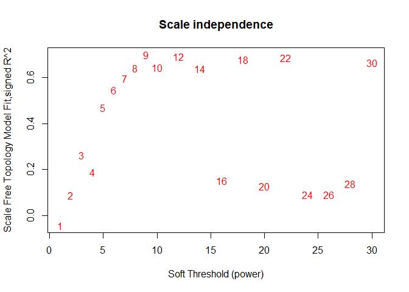
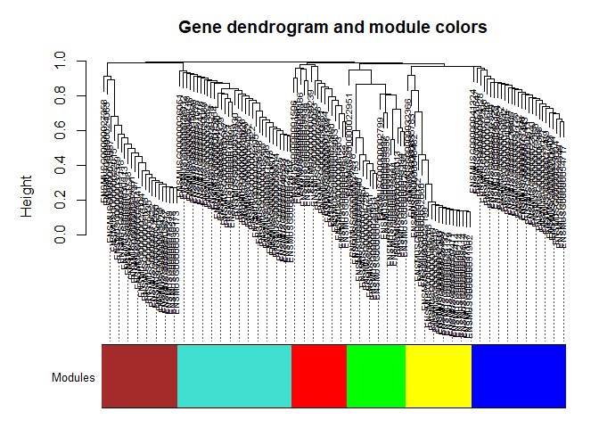

<!-- README.md is generated from README.Rmd. Please edit that file -->

# scWGCNA

<!-- badges: start -->
<!-- badges: end -->

scWGCNA is an adaptation of WGCNA to work with single-cell datasets. The
functionality is presented in
<a href="http://doi.org/10.1002/dvdy.384" target="_blank">Feregrino &
Tschopp 2021</a>

The new version of the package allows for a better workflow.

scWGCNA works with Seurat objects.

## Installation

To install scWGCNA run in R:

## Basic scWGCNA workflow

-   Our first step is to calculate pseudocells from a Seurat object with
    pre.calculated PCA (or other reductions) and cell clusters. For this
    example we are using the small pbmc dataset from Seurat.
    **Warning**: This might be very time or memory consuming depending
    on the size of your dataset. (ca. 15 minutes for 10k cells).
    Consider to run this on a script for a dedicated job.

``` r
library(scWGCNA)
#> 

pbmc_small = SeuratObject::pbmc_small

pbmc_small.pcells = calculate.pseudocells(s.cells = pbmc_small,
                                          seeds=0.2,
                                          nn = 10,
                                          reduction = "pca",
                                          dims = 1:10)
#> Computing nearest neighbor graph
#> Computing SNN
#> Choosing seeds
#> 77 out of 80 Cells will be agreggated into 15 Pseudocells
#> Assining pseudocells
#> Aggregating pseudocell expression
#> Warning: The following arguments are not used: row.names
```

-   Our next step is to perform WCGNA analyses From this, we will obtain
    a scWGNCA object, which is a list with information obtained from the
    analyses. For this, we suggest to use the pseudocells, calculated as
    shown above. For the sake of this example, using such a small
    dataset, using pseudocells is not feasible. For this reason, we use
    again the single cells. We also ask for the analysis to be started
    with all the genes in our example dataset, as this is very small.
    Normally, the function would find variable genes for us.

``` r
pbmc_small.scWGCNA = run.scWGCNA(p.cells = pbmc_small, # Pseudocells (recommended), or single cells in seurat format
                                 s.cells = pbmc_small, # single cells in seurat format
                                 is.pseudocell = FALSE, # We are using single cells twice this time
                                 features = rownames(pbmc_small)) # All genes this time. Recommended: variable genes
#> [1] "We have 230 genes in the variable genes object"
#> Warning: executing %dopar% sequentially: no parallel backend registered
#> Warning in (function (x, y = NULL, robustX = TRUE, robustY = TRUE, use =
#> "all.obs", : bicor: zero MAD in variable 'x'. Pearson correlation was used for
#> individual columns with zero (or missing) MAD.
#> Warning in (function (x, y = NULL, robustX = TRUE, robustY = TRUE, use =
#> "all.obs", : bicor: zero MAD in variable 'y'. Pearson correlation was used for
#> individual columns with zero (or missing) MAD.
#>    Power SFT.R.sq  slope truncated.R.sq mean.k. median.k. max.k.
#> 1      1   0.0233  2.220       5.17e-01 115.000  1.15e+02 123.00
#> 2      2   0.0130 -1.460       4.36e-01  60.900  6.01e+01  70.50
#> 3      3   0.3190 -4.430       7.77e-01  33.800  3.32e+01  44.60
#> 4      4   0.5640 -4.320       9.09e-01  19.700  1.91e+01  30.20
#> 5      5   0.7220 -3.290       8.92e-01  12.200  1.15e+01  21.50
#> 6      6   0.8190 -2.530       8.05e-01   7.880  7.13e+00  17.10
#> 7      7   0.8170 -2.380       7.70e-01   5.360  4.52e+00  15.30
#> 8      8   0.8530 -2.090       8.11e-01   3.810  2.94e+00  14.00
#> 9      9   0.8450 -1.920       8.10e-01   2.810  2.00e+00  13.00
#> 10    10   0.8210 -1.790       8.01e-01   2.150  1.36e+00  12.10
#> 11    12   0.8720 -1.560       8.71e-01   1.360  6.97e-01  10.80
#> 12    14   0.1470 -2.070      -3.67e-02   0.944  3.75e-01   9.75
#> 13    16   0.1480 -1.970      -4.22e-02   0.699  2.06e-01   8.89
#> 14    18   0.0292 -0.801      -2.92e-06   0.544  1.14e-01   8.18
#> 15    20   0.1100 -1.470      -2.40e-02   0.440  6.35e-02   7.57
#> 16    22   0.1130 -1.420      -2.36e-02   0.365  3.88e-02   7.05
#> 17    24   0.1140 -1.740      -2.81e-02   0.311  2.29e-02   6.59
#> 18    26   0.1130 -1.730      -5.09e-02   0.269  1.36e-02   6.19
#> 19    28   0.0921 -1.130       1.47e-02   0.236  8.38e-03   5.84
#> 20    30   0.0990 -1.110       1.05e-02   0.209  5.04e-03   5.52
#> [1] "Or power is 12"
#> Warning in (function (x, y = NULL, robustX = TRUE, robustY = TRUE, use =
#> "all.obs", : bicor: zero MAD in variable 'x'. Pearson correlation was used for
#> individual columns with zero (or missing) MAD.
#> TOM calculation: adjacency..
#> ..will not use multithreading.
#>  Fraction of slow calculations: 0.000000
#> ..connectivity..
#> ..matrix multiplication (system BLAS)..
#> ..normalization..
#> ..done.
#> [1] "my.height:  0.9949  .... my.Clsize:  15"
#> 54 genes not assigned to any module.
#> 11 genes excluded due to significance.
#> Warning in (function (x, y = NULL, robustX = TRUE, robustY = TRUE, use =
#> "all.obs", : bicor: zero MAD in variable 'x'. Pearson correlation was used for
#> individual columns with zero (or missing) MAD.
```



    #> TOM calculation: adjacency..
    #> ..will not use multithreading.
    #>  Fraction of slow calculations: 0.000000
    #> ..connectivity..
    #> ..matrix multiplication (system BLAS)..
    #> ..normalization..
    #> ..done.
    #> [1] "my.height:  0.9944  .... my.Clsize:  15"
    #> 0 genes not assigned to any module.
    #> 0 genes excluded due to significance.

-   We can now see which modules where detected by WGCNA after the
    iterations

``` r
# Plot the gene / modules dendrogram
scWGCNA.plotdendro(scWGCNA.data = pbmc_small.scWGCNA)
```



``` r
#Look at the membership tables
names(pbmc_small.scWGCNA$modules)
#> [1] "1_blue"      "2_brown"     "3_green"     "4_turquoise" "5_yellow"

#Let's look at the first module, "blue"
head(pbmc_small.scWGCNA$modules$`1_blue`)
#>        Membership        p.val
#> S1PR4   0.3198069 3.830700e-03
#> CTSW    0.8359740 5.039547e-22
#> NKG7    0.7997482 5.797987e-19
#> CST7    0.8490035 2.592946e-23
#> GIMAP1  0.3819005 4.730882e-04
#> KLRG1   0.4424703 3.964699e-05
```

-   We can also plot what’s the mean expression of all, or each module,
    across the single cells

``` r
# Plot the expression of all modules at once
scWGCNA.plotexpression(s.cells = pbmc_small,
                       scWGCNA.data = pbmc_small.scWGCNA, 
                       modules = "all", 
                       ncol=3)
```


``` r
#Plot only the expression of the first module, "blue"
scWGCNA.plotexpression(s.cells = pbmc_small,
                       scWGCNA.data = pbmc_small.scWGCNA,
                       modules = 1)
```


-   We can also plot the different modules in a network visualization,
    to observe the relationships between the genes.

``` r
# First generate the networks in the scWCGNA object
pbmc_small.scWGCNA = scWGCNA.networks(scWGCNA.data = pbmc_small.scWGCNA)
#> Registered S3 method overwritten by 'GGally':
#>   method from   
#>   +.gg   ggplot2

# Plot the module "blue" as a network
scWGCNA.plotnetwork(pbmc_small.scWGCNA, module=1)
```


-   Perform comparative WCGNA analyses and output an integrated HTML
    report

<!-- -->

    scWGNA.compare.report(data, test, test.names, project.name, ortho, ortho.sp)

## Output examples

These are the HTML outputs you can expect from the functions. The data
used in our publication produced [this HTML report
output](https://htmlpreview.github.io/?https://github.com/CFeregrino/scWGCNA/blob/main/HTMLexamples/WGCNA_report_E15test3_080421.html)
from the scWGNA.report function, and [this HTML report
output](https://htmlpreview.github.io/?https://github.com/CFeregrino/scWGCNA/blob/main/HTMLexamples/WGNA_comparative_E15.nb.html)
from the scWGNA.compare.report function.

## References

<a href="https://bmcbioinformatics.biomedcentral.com/articles/10.1186/1471-2105-9-559" target="_blank">Langfelder,
P., Horvath, S. (2008) WGCNA: an R package for weighted correlation
network analysis. BMC Bioinformatics 9, 559</a>

<a href="https://journals.plos.org/ploscompbiol/article?id=10.1371/journal.pcbi.1001057" target="_blank">Langfelder
P, Luo R, Oldham MC, Horvath S (2011) Is My Network Module Preserved and
Reproducible?. PLOS Computational Biology 7(1): e1001057</a>

<a href="https://doi.org/10.1101/2021.02.09.430383" target="_blank">Feregrino,
C, Tschopp, P (2021) Assessing evolutionary and developmental
transcriptome dynamics in homologous cell types. bioRxiv
2021.02.09.430383</a>
